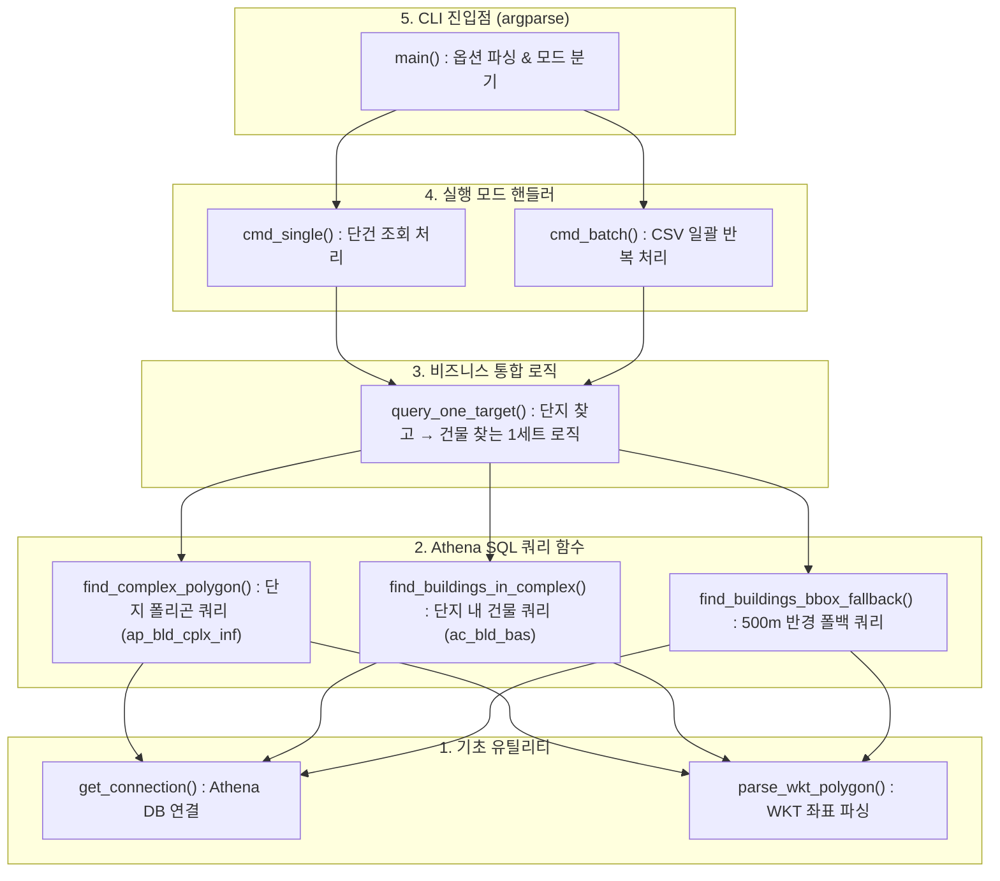

# MOIRA Athena 연동 (단지/건물 폴리곤 실제 조회)

`DB_structure.pdf` §3-2/§3-4에 정의된 공간조인을 실제 Athena에서 실행하는 부분. 이 디렉토리의 코드는
**사내망(idcube 접근 가능 환경)에서만 동작**하며, 이 저장소 자체(개발 샌드박스)에서는
`idcube_hive_connector` 패키지가 없어 실행/테스트가 불가능했습니다. 사내망에서 직접 검증이 필요합니다.

## 구조

```
apt_list.csv (RAPA Key, 위경도)
      │  RAPA Key 드롭다운 선택
      ▼
React 앱 → GET /api/moira-polygon?rapaKey=..&lat=..&lng=..   (server.ts)
      │  child_process로 python 스크립트 호출
      ▼
athena/query_moira.py single --rapa-key .. --lat .. --lng ..
      │  idcube_hive_connector.connector.connect_idcube_athena() + pandas.read_sql_query
      │  1) o_moira.ap_bld_cplx_inf 에서 위경도를 포함하는 단지 폴리곤 & bld_cplx_inf_id 조회 (ST_Contains)
      │  2) c.bld_cplx_inf_id로 o_moira.ac_bld_bas 건물들과 공간 조인 (ST_Intersects) — 정확한 단지 내 건물 확보
      ▼
stdout에 JSON 1줄 → server.ts가 그대로 프론트에 전달 → 캔버스 좌표로 변환해 렌더
```

프론트엔드(`handleSelectRapaKey`, `src/App.tsx`)는 2단계입니다 (2026-08-14 캐시 우선으로 변경):
1. **배치 캐시** (`public/complex_polygons.json`) — 해당 RAPA Key가 캐시에 있으면 즉시 사용, 실시간 쿼리 생략
2. **Athena 실시간** (`/api/moira-polygon`) — 캐시에 없는 키일 때만 시도, 사내망에서만 성공

**VWorld는 단지/건물 폴리곤 소스로 더 이상 쓰지 않습니다.** (2026-08-13 확정) 실제 2027년 신규 아파트에 대한
실전 분석이므로, MOIRA(Athena) 폴리곤을 못 가져오면 잘못된 데이터로 조용히 대체하는 대신 명확히 실패로
표시하고 멈춥니다 — 맵 배경 타일(CartoDB/Esri)과 사용자가 별도로 쓰는 수동 VWorld 검색 기능은 그대로
유지되지만, RAPA Key 선택 흐름과는 무관합니다.

UI 우측 "선택된 RAPA 대상" 카드에 어떤 소스를 썼는지(✓ Athena 실시간 / ◐ 배치 캐시 / ✕ 조회 실패) 표시됩니다.

## 코드 계층 구조 및 모듈화 설계

`athena/query_moira.py`는 CLI 도구, 백엔드 연동, 주피터 노트북 재사용성을 모두 고려하여 **5개 계층(Layer)**으로 설계되었습니다:



---

## 실행 모드 및 CLI 옵션 (`argparse` 서브커맨드)

`git commit`, `docker run`처럼 명령어 뒤에 서브커맨드(`single` 또는 `batch`)를 붙여 목적에 맞게 실행합니다.

### 1) `single` 모드 (실시간 단건 조회)
Node.js 백엔드 서버(`/api/moira-polygon`)가 실시간으로 1개 아파트만 조회할 때 호출합니다.
진행 로그는 `stderr`로 출력하고, **`stdout`에는 순수 JSON 한 줄만 출력**하여 백엔드가 안전하게 파싱합니다.

| 옵션 | 필수 | 기본값 | 설명 |
|---|---|---|---|
| `--rapa-key` | Y | - | 대상 RAPA 식별코드 |
| `--lat` | Y | - | 대상 위도 |
| `--lng` | Y | - | 대상 경도 |
| `--complex-buffer` | N | `0.005` | 단지 폴리곤 미발견 시 폴백 BBox 반경 (약 500m) |
| `--bld-usg-filter` | N | `'주택'` | BBox 폴백 시 건물 용도 필터 (`bld_lcl_nm`) |

```bash
# 실행 예시
python athena/query_moira.py single --rapa-key m-RAPA-2305-1745 --lat 37.40080703 --lng 126.9472091
```

### 2) `batch` 모드 (CSV 일괄 배치 조회 & 캐시 생성)
전체 아파트 목록을 순회하며 Athena 조회를 수행하고, 진행률(`tqdm`)을 표시하며 최종 결과를 JSON 파일로 저장합니다.

| 옵션 | 필수 | 기본값 | 설명 |
|---|---|---|---|
| `--csv` | N | `'apt_list.csv'` | 입력 아파트 CSV 파일 경로 |
| `--out` | N | `'public/complex_polygons.json'` | 출력 JSON 캐시 파일 경로 |
| `--rapa-key` | N | None | 특정 RAPA Key만 지정 조회 (반복 지정 가능) |
| `--limit` | N | None | 상위 N개 대상만 테스트 조회 |
| `--complex-buffer` | N | `0.005` | BBox 폴백 반경 |
| `--bld-usg-filter` | N | `'주택'` | BBox 폴백 건물 용도 필터 |

```bash
# 1. 전체 CSV 일괄 조회
python athena/query_moira.py batch --csv apt_list.csv --out public/complex_polygons.json

# 2. 테스트용 상위 5개만 조회
python athena/query_moira.py batch --limit 5

# 3. 특정 2개 단지만 콕 집어서 조회
python athena/query_moira.py batch --rapa-key m-RAPA-2305-1745 --rapa-key m-RAPA-2202-0846
```

---

## 사내 Jupyter Notebook에서 실행하는 방법

사내 주피터 환경에서 `query_moira.py` 코드를 활용할 때의 3가지 방법:

### 방법 A: 함수 직접 호출 (가장 추천)
주피터 셀에 코드를 넣은 후, 아래와 같이 파이썬 객체로 직접 호출:
```python
# 1) 전체 배치 실행
class Args:
    csv = 'apt_list.csv'
    out = 'complex_polygons.json'
    rapa_key = None      # 특정 키만 하려면 ['m-RAPA-2305-1745']
    limit = None         # 테스트로 5개만 하려면 5
    complex_buffer = 0.005
    bld_usg_filter = '주택'

cmd_batch(Args())
```

### 방법 B: 1개 단지만 즉시 테스트
```python
conn = get_connection()
result = query_one_target(
    conn=conn,
    rapa_key='m-RAPA-2305-1745',
    lat=37.40080703,
    lng=126.9472091,
    buffer_deg=0.005,
    bld_usg_filter='주택'
)
print(f"단지: {result['complex']}")
print(f"건물 수: {len(result['buildings'])}개")
```

### 방법 C: `%run` 매직 커맨드로 파일 통째 실행
```python
%run athena/query_moira.py batch --csv apt_list.csv --out complex_polygons.json
```

---

## 사내망에서 확인하는 법

1) 스크립트 단독 실행 (Athena 연결 자체가 되는지 먼저 확인):
```bash
python athena/query_moira.py single \
  --rapa-key m-RAPA-2305-1745 --lat 37.40080703 --lng 126.9472091
```
stdout에 JSON 한 줄이 나오면 성공. `idcube_hive_connector` import나 `connect_idcube_athena()`가 실패하면
`{"error": "..."}` 가 나옵니다.

2) 앱에서 확인:
```bash
npm run dev
# 상단바 RAPA Key 드롭다운에서 대상 선택 → "✓ Athena 실시간" 뱃지가 뜨는지 확인
```
python 실행 파일 이름이 `python3`가 아니면 환경변수로 지정:
```bash
MOIRA_PYTHON_BIN=python npm run dev
```

3) 배치 캐시 미리 생성(오프라인/사내망 밖에서도 확인 가능하게):
```bash
python athena/query_moira.py batch --csv apt_list.csv --out public/complex_polygons.json
```

## 확인이 필요한 가정 (제가 추측한 부분)

- 쿼리 문법: `ST_Contains`, `ST_GeomFromBinary`, `ST_AsText`, `ST_Point` — `DB_structure.pdf`의 예제 SQL을
  그대로 따랐습니다. Athena 엔진 버전에서 이 Presto/Trino geospatial 함수들이 실제로 지원되는지 확인 필요.
- `pd.read_sql_query(query, conn)` — 주신 `daily_tmap_querying_k()` 예시와 동일한 패턴 사용. `conn`이
  DB-API 커서 프로토콜을 지원한다고 가정.
- `o_moira.ac_bld_bas.bld_lcl_nm = '주택'` 필터는 500m BBox 폴백 쿼리에만 적용(PDF §3-3과 동일). 단지
  폴리곤 안쪽 조회(§3-4)는 PDF 예제처럼 필터 없음 — 필요하면 조정.
- 단지 폴리곤 조회 시 `cplx_mcl_nm = '아파트'` 고정 — apt_list.csv 대상이 전부 아파트/공동주택이 아니라면
  (일부 행은 '일반', '근린생활시설' 등) 이 필터가 맞지 않을 수 있음.
- Node → Python 호출은 요청마다 새 프로세스를 띄우는 방식(`child_process.execFile`, 타임아웃 45초)이라
  Athena 쿼리가 오래 걸리면 실패할 수 있음. 실제 지연 시간을 보고 타임아웃/방식(예: 상시 대기 프로세스,
  캐싱)을 조정하는 게 좋습니다.

## 보안

AWS 자격증명은 이 저장소 어디에도 없습니다 — `idcube_hive_connector`가 사내망에서 자체적으로 인증을
처리한다고 가정했습니다(주신 예시 코드와 동일). `.env`는 `.gitignore`에 추가해뒀습니다.


# ==============================================================================
# LOS Simulator & MOIRA Athena 배치 / 실시간 쿼리 Python 의존성 목록
# ==============================================================================

# [사내망 전용 패키지]
# 사내 PyPI / Nexus 레포지토리에서 설치됩니다. (사외망에서는 설치 불가)
# 설치 예시: pip install --extra-index-url <사내_PYPI_URL> -r requirements.txt
idcube-hive-connector
infrabot-diy-python-client

# [공간 연산 & 데이터 처리]
pandas>=2.0.0
numpy>=1.24.0
pyathena>=3.0.0
shapely>=2.0.0
openpyxl>=3.1.0
tqdm>=4.65.0

# [DB & ORM (atom_moira.py 등 추가 ETL 용도)]
SQLAlchemy>=2.0.0
psycopg2-binary>=2.9.0
requests>=2.31.0
