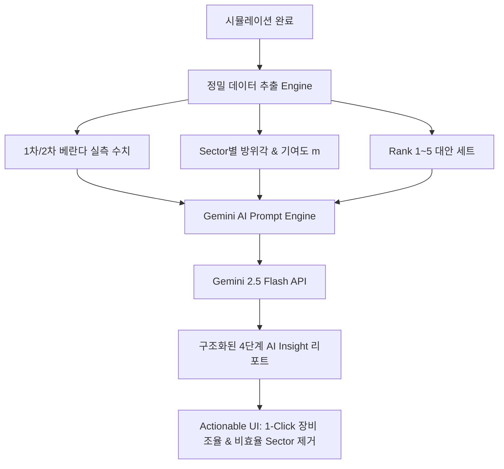

# AI Insight 고도화 기획 사양서 (`AI_insight.md`)

> **문서 정보**  
> - **작성일자**: 2026년 7월 29일  
> - **작성자**: SKT Access Eng팀 장영우 
> - **목적**: 건물 베란다 O2I 시뮬레이션 결과를 기반으로 Gemini AI가 RF 전파 환경 및 장비 효율성을 전문적으로 분석하고 실무 조치를 제안하는 AI Insight 기능 고도화 명세

---

## 1. 개요 및 배경 (Overview)

기존 AI Insight 기능은 시뮬레이션 결과(전체 커버리지 %, 배치 장비 수, 동별 비율)를 단순 요약하는 수준에 머물러 있었습니다.  
본 사양은 **현장 RF 최적화 엔지니어 수준의 정교한 분석 데이터 제공**, **구조화된 4단계 전문 리포트 생성**, 그리고 **AI 분석 결과에서 1-Click으로 장비를 조율하는 액션 연동 UI**를 구축하는 것을 목적으로 합니다.

---

## 2. 4대 핵심 개선 아키텍처 (Core Architecture)



### ① 입력 데이터 정밀화 (Rich Context Delivery)
AI 모델에 전달되는 페이로드를 세분화하여 정밀 분석의 기반을 제공합니다.

| 데이터 분류 | 주요 항목 | 상세 내용 |
| :--- | :--- | :--- |
| **베란다 구분 수치** | 1차 베란다 / 2차 베란다 | 1차 베란다(100% 모수) 총 거리 & 커버 거리<br>2차 베란다(70% 가점) 총 거리 & 투영 보너스 거리(m) |
| **Sector 세부 기여도** | Site & Sector 명세 | 각 Sector ID (`M-1-A`, `AUTO-2-B`), 방위각(0~359°), 개별 커버 거리(m), 수동/자동 여부 |
| **대안 세트 (Rank)** | Rank 1~5 결과 | Rank 1(선택) 대비 Rank 2~5의 Site 수량, Sector 수량, 커버리지 차이 |
| **파라미터 조건** | 시뮬레이션 모드 & 제약 | Pure Manual / Manual + 2nd Veranda / Full Auto 구분, Beamwidth, Max Range |

---

### ② RF 수석 엔지니어급 AI 프롬프트 체계화 (Prompt Engineering)

Gemini API 프롬프트를 4단계 전문 리포트 구조로 명확히 정의합니다.

```markdown
1. 📈 종합 진단 및 효율성 뱃지 (Status Badges)
   - 목표 커버리지 달성 여부 및 CAPEX(장비 수량) 대비 투자 효율성 평가

2. 🏢 동(건물)별 O2I 투과 & 음영 구조 원인 분석
   - 커버리지 저조 동의 기하학적 차폐 원인 및 베란다 지향 적정성 평가

3. 📡 Sector 단위 미세 조정 & 비효율 장비 제거 제안 (핵심)
   - [저효율 Sector 식별]: 기여 미터(m)가 미미하거나 타 Sector와 중복된 Sector 명시
   - [방위각 회전 제안]: 특정 Sector의 Azimuth 조정 팁 (예: M-1-A 0° → 35° 회전 시 +15m 증가)
   - [제거 권장]: 해당 Sector 제거 시 전체 커버리지 손실 수치 계산 및 절감 제안

4. 💡 Rank 1~5 대안 세트 경제성 비교 (ROI Analysis)
   - Rank 1 대비 Rank 2~5의 장비 1대 절감 시 커버리지 변동폭 경제성 비교
```

---

### ③ 액션 연동 UI/UX (Actionable UI Recommendations)

AI 분석 결과를 확인한 사용자가 캔버스에서 즉시 최적화를 실행할 수 있는 인터랙티브 UI를 제공합니다.

- **1-Click 비효율 Sector 제거**: AI가 지목한 저효율 Sector 항목 옆 `[추천 제거]` 버튼 클릭 시 해당 Sector 즉시 삭제 및 시뮬레이션 재계산
- **1-Click 방위각 자동 조정**: AI가 제안한 최적 각도(예: `M-1-A 45° → 65°`) 클릭 시 해당 Sector 방위각 즉시 반영
- **Tab 방식 리포트 UI**:
  - `[종합 요약]` / `[장비 미세조정 & 제거]` / `[Rank 대안 비교]` 3개 탭으로 분리하여 가독성 증대

---

## 3. 백엔드 API & 프롬프트 명세서 (`server.ts`)

```typescript
// /api/ai-insights 요청 프롬프트 구조 예시
const prompt = `당신은 3GPP 표준 및 O2I 베란다 투과 알고리즘 기반 SKT RF 최적설계 수석 엔지니어입니다.
아래 상세 시뮬레이션 데이터를 분석하여 현장 실무에 즉시 적용 가능한 4단계 가이드를 작성하세요.

[시뮬레이션 조건]
- 실행 모드: ${params.simulationMode}
- 빔폭: ${params.beamWidth}°, 최대도달거리: ${params.maxRange}m
- 1차 베란다 총 거리: ${firstTotalMeters}m / 2차 베란다 총 거리: ${secondTotalMeters}m

[커버리지 분석 결과]
- 1차 베란다 커버리지(모수): ${result.coverageRatio.toFixed(1)}% (목표: ${params.targetCoverage}%)
- 2차 베란다 전파 투영 보너스: +${secondCoveredMeters}m
- 총 투입 장비: ${uniqueSitesCount}개 Site / ${sectorCount}개 Sector

[건물별 커버리지 세부]
${buildingDetails}

[Sector별 개별 커버리지 기여도 및 방위각]
${sectorDetails}

[Rank 1~5 대안 비교 세트]
${rankDetails}

[작성 지침]
- 마크다운 불릿 포인트를 사용하여 간결하고 명확하게 작성하세요.
- 1. 📈 종합 진단 (성능 평가)
- 2. 🏢 동별 음영 원인 분석
- 3. 📡 Sector 방위각 미세조정 & 비효율 Sector 제거 제안 (특정 Sector ID 필수 기재)
- 4. 💡 Rank 대안 세트 경제성 비교 (CAPEX 대비 ROI 분석)
`;
```

---

## 4. 단계별 구현 로드맵 (Implementation Roadmap)

1. **1단계 (Data Preparation)**: `App.tsx`에서 1차/2차 베란다 실측 거리, Sector별 방위각/기여도, Rank 1~5 비교 객체를 `/api/ai-insights` 페이로드로 전송
2. **2단계 (Prompt Refinement)**: `server.ts`에서 수석 RF 엔지니어 페르소나 및 4단계 분석 가이드라인 프롬프트 적용
3. **3단계 (Interactive UI)**: AI Insight 패널에 탭(Tab) UI 구축 및 추천 액션(비효율 Sector 제거/각도 조정) 1-Click 연동 구현
