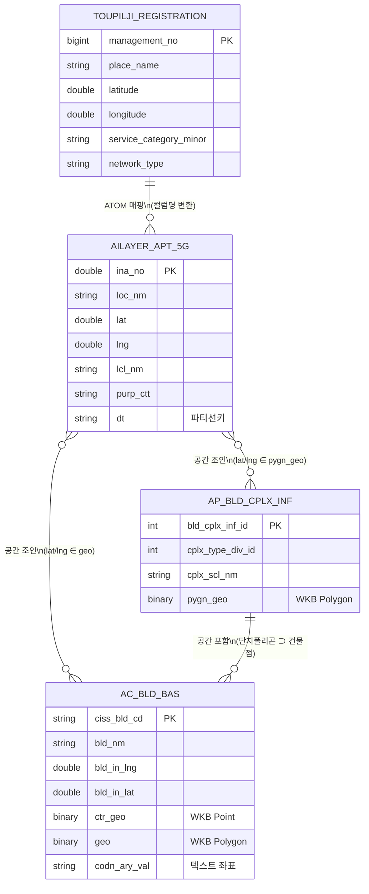
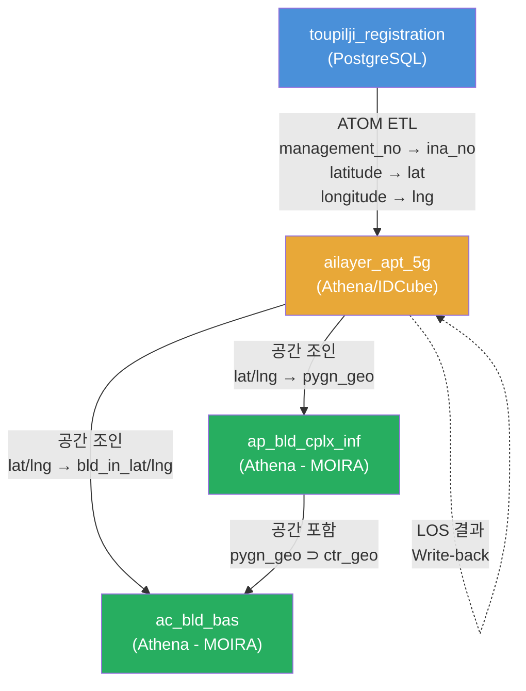

# 데이터베이스 스키마 & 연동 구조 정의서

> **최종 업데이트**: 2026-08-08

## 1. 테이블 관계 전체 개요 (ER Diagram)



---

## 2. 테이블별 상세 스키마

### 테이블 ①: `new_coverage.toupilji_registration`

| 구분 | 내용 |
|---|---|
| **DB 엔진** | PostgreSQL |
| **접근 방식** | SQLAlchemy + psycopg2 (환경변수 인증) |
| **역할** | 투자필요지역 원본 등록 테이블 |

#### 주요 컬럼 (ATOM 매핑 기준 66개 중 핵심)

| 원본 컬럼명 | 매핑 후 (ailayer) | 타입 | 설명 |
|---|---|---|---|
| `management_no` | `ina_no` | double | 관리번호 (PK 역할) |
| `invest_area_name` | `smtso_nm` | string | 투자대상 지역명 |
| `network_type` | `net_div_nm` | string | 네트워크 유형 (5G 필터) |
| `division` | `hdofc_nm` | string | 지역본부 |
| `sido` | `mcp_nm` | string | 시도명 |
| `sigungu` | `sgg_nm` | string | 시군구명 |
| `eupmyeondong` | `emd_nm` | string | 읍면동명 |
| `detail_address` | `dtl_addr` | string | 상세주소 |
| `latitude` | `lat` | double | **위도** |
| `longitude` | `lng` | double | **경도** |
| `service_category_minor` | `purp_ctt` | string | 소분류 (아파트단지 필터) |
| `place_name` | `loc_nm` | string | **장소명(단지명)** |
| `building_count` | `bldblk_cnt` | double | 건물(동) 수 |
| `floors_above` | `grud_flor_cnt` | double | 지상 층수 |
| `floors_below` | `bsmt_flor_cnt` | Int64 | 지하 층수 |
| `opening_year` | `open_ym` | Int64 | 개통 예정년월 |
| `investment_purpose` | `cvrg_typ_cd` | string | 투자 목적 |
| `investment_reason` | `invt_rsn` | string | 투자 사유 |
| `service_category_major` | `lcl_nm` | string | 대분류 |
| `created_at` | `reg_dt` | Int64 | 등록일 (YYYYMMDD 변환) |

> [!NOTE]
> 전체 66개 컬럼 매핑은 [atom_moira.py L79-86](file:///Users/1109425/playground-eng-apt-cover-windows/extra/atom_moira.py#L79-L86)에서 `var_list` → `cols` 순서 기준으로 정의됩니다.

---

### 테이블 ②: `p_common.ailayer_apt_5g`

| 구분 | 내용 |
|---|---|
| **DB 엔진** | AWS Athena (IDCube) |
| **접근 방식** | `idcube_hive_connector` (pyathena PandasCursor) |
| **파티션 키** | `dt` (YYYYMMDD) |
| **역할** | 아파트 최적설계 분석 대상 **중심 허브 테이블** |

#### 전체 컬럼 스키마 (66개 + 파티션 키)

| # | 컬럼명 | 타입 | 설명 | 비고 |
|---|---|---|---|---|
| 1 | `data_type` | Int64 | 데이터 유형 | ATOM이 1로 고정 |
| 2 | `ina_no` | double | 관리번호 | **사실상 PK** |
| 3 | `smtso_nm` | string | 투자대상 지역명 | `_숫자` 접미사 제거됨 |
| 4 | `net_div_nm` | string | 네트워크 유형 | 5G |
| 5 | `reg_dt` | Int64 | 등록일 | YYYYMMDD |
| 6 | `ins_id` | double | 등록자 ID | 0 (미사용) |
| 7 | `mod_date` | double | 수정일 | 0 (미사용) |
| 8 | `mod_id` | double | 수정자 ID | 0 (미사용) |
| 9 | `hdofc_nm` | string | 지역본부 | |
| 10 | `mcp_nm` | string | 시도명 | |
| 11 | `sgg_nm` | string | 시군구명 | |
| 12 | `emd_nm` | string | 읍면동명 | |
| 13 | `dtl_addr` | string | 상세주소 | |
| 14 | **`lat`** | **double** | **위도** | **MOIRA 매칭 키** |
| 15 | `lttag` | int | 위도 도 | |
| 16 | `lttmn` | int | 위도 분 | |
| 17 | `lttsc` | double | 위도 초 | |
| 18 | **`lng`** | **double** | **경도** | **MOIRA 매칭 키** |
| 19 | `ltdag` | int | 경도 도 | |
| 20 | `ltdmn` | int | 경도 분 | |
| 21 | `ltdsc` | double | 경도 초 | |
| 22 | `cvrg_typ_cd` | string | 커버리지 유형 | |
| 23 | `open_ym` | Int64 | 개통 예정년월 | |
| 24 | `invt_rsn` | string | 투자 사유 | |
| 25 | `lcl_nm` | string | 대분류명 | |
| 26 | `purp_ctt` | string | 소분류(용도) | 아파트단지 |
| 27 | **`loc_nm`** | **string** | **장소명(단지명)** | **MOIRA 매칭 보조 키** |
| 28 | `scal_val` | Int64 | 규모 | |
| 29 | `gen_unit` | string | 단위 | |
| 30 | `bldblk_cnt` | double | 건물(동) 수 | |
| 31 | `scal_ar` | Int64 | 규모 면적 | |
| 32 | `grud_flor_cnt` | double | 지상 층수 | |
| 33 | `bsmt_flor_cnt` | Int64 | 지하 층수 | |
| 34 | `flor_pyng_val` | Int64 | 평형 | |
| 35 | `new_exst_div_cd` | string | 신규/기존 구분 | |
| 36-66 | *(나머지 31개)* | mixed | 장비/부가 정보 | 대부분 0 또는 미사용 |
| **PK** | **`dt`** | **string** | **파티션 키 (YYYYMMDD)** | ATOM 실행일 |

---

### 테이블 ③: `o_moira.ap_bld_cplx_inf`

| 구분 | 내용 |
|---|---|
| **DB 엔진** | AWS Athena (IDCube) |
| **접근 방식** | `GetQuery_PandasCursor` (pyathena) |
| **역할** | **아파트 단지 전체 폴리곤** (개별 동이 아닌 단지 경계) |

#### 전체 컬럼 스키마

| # | 컬럼명 | 타입 | 설명 | 비고 |
|---|---|---|---|---|
| 1 | **`bld_cplx_inf_id`** | **int** | **단지 정보 ID (PK)** | |
| 2 | `cplx_type_div_id` | int | 단지 유형 구분 ID | 200114, 200103 등 |
| 3 | `src_dat_id` | int | 소스 데이터 ID | 외부 출처 참조 |
| 4 | `cplx_lcl_nm` | string | 단지 대분류명 | 예: 주택 |
| 5 | `cplx_mcl_nm` | string | 단지 중분류명 | 예: 아파트 |
| 6 | `cplx_scl_nm` | string | 단지 소분류명 | 관리사무소, 일반아파트 |
| 7 | **`pygn_geo`** | **binary** | **단지 폴리곤 (WKB)** | EPSG:4326 |
| 8 | `reg_dtm` | double | 등록 일시 | |

> [!IMPORTANT]
> **단지명(아파트 이름)이 이 테이블에 없습니다.** `cplx_scl_nm`은 분류명일 뿐, "래미안", "자이" 같은 고유 단지명이 아닙니다.

---

### 테이블 ④: `o_moira.ac_bld_bas`

| 구분 | 내용 |
|---|---|
| **DB 엔진** | AWS Athena (IDCube) |
| **접근 방식** | `GetQuery_PandasCursor` (pyathena) |
| **역할** | **전국 개별 건물 기본 정보 + 건물 폴리곤** |

#### 주요 컬럼 스키마

| # | 컬럼명 | 타입 | 설명 | 비고 |
|---|---|---|---|---|
| 1 | **`ciss_bld_cd`** | **string** | **건물 코드 (PK)** | `N경도 위도` 형태 |
| 2 | `pnu_ltno_cd` | bigint | PNU 지번 코드 | 19자리 토지고유번호 |
| 3 | `ldong_cd` | bigint | 법정동 코드 | |
| 4 | `adong_cd` | bigint | 행정동 코드 | |
| 5 | `st_nm_cd` | bigint | 도로명 코드 | |
| 6 | `hdofc_nm` | string | 관할 사무소명 | |
| 7 | `mcp_abbr_nm` | string | 시도 약칭 | |
| 8 | `bld_nm` | string | **건물명** | |
| 9 | `bld_dtl_nm` | string | 건물 상세명 | |
| 10 | `bld_lcl_nm` | string | 건물 대분류명 | 주택, 빌딩 등 |
| 11 | `bld_scl_nm` | string | 건물 소분류명 | 단독, 아파트 등 |
| 12 | `bld_usg_cd` | int | 건물 용도 코드 | |
| 13 | `bld_usg_nm` | string | 건물 용도명 | |
| 14 | `grud_flor_cnt` | int | **지상 층수** | LOS 시뮬에 필수 |
| 15 | `bsmt_flor_cnt` | int | 지하 층수 | |
| 16 | `bld_hght` | double | **건물 높이** | LOS 시뮬에 필수 |
| 17 | `bld_ar` | double | 건물 면적 | |
| 18 | **`bld_in_lng`** | **double** | **건물 중심 경도** | **공간 조인 키** |
| 19 | **`bld_in_lat`** | **double** | **건물 중심 위도** | **공간 조인 키** |
| 20 | **`ctr_geo`** | **binary** | **건물 중심점 (WKB Point)** | EPSG:4326 |
| 21 | **`geo`** | **binary** | **건물 폴리곤 (WKB Polygon)** | EPSG:4326 |
| 22 | **`codn_ary_val`** | **string** | **좌표 배열 (텍스트)** | `lng:lat;lng:lat;...` |

---

## 3. 테이블 간 연동 구조 (관계 & 키)

### 3-1. `toupilji_registration` → `ailayer_apt_5g` (컬럼 매핑)

**연결 방식**: ATOM 스크립트에 의한 **컬럼명 1:1 매핑 변환**


| 원본 (toupilji) | 변환 후 (ailayer) | 매핑 유형 |
|---|---|---|
| `management_no` | `ina_no` | **직접 매핑 (PK)** |
| `latitude` | `lat` | 직접 매핑 |
| `longitude` | `lng` | 직접 매핑 |
| `place_name` | `loc_nm` | 직접 매핑 |
| `invest_area_name` | `smtso_nm` | 직접 매핑 + `_숫자` 제거 |
| *(없음)* | `data_type` | **상수 할당 (=1)** |
| *(없음)* | `dt` | **실행일 자동 생성** |
| *(없음)* | `ins_id`, `mod_date` 등 | **더미 값 (=0)** |

> [!NOTE]
> **FK 관계가 아닙니다.** ATOM이 데이터를 **복사 변환**하는 ETL 관계이므로, 원본이 변경되어도 ailayer에 자동 반영되지 않습니다. ATOM 재실행이 필요합니다.

---

### 3-2. `ailayer_apt_5g` ↔ `ap_bld_cplx_inf` (공간 조인)

**연결 방식**: **명시적 FK 없음** → **공간 조인 (Spatial Join)** 필요

```sql
-- ailayer의 아파트 위치가 단지 폴리곤 안에 포함되는지 판정
SELECT 
    a.ina_no, a.loc_nm, a.lat, a.lng,
    c.bld_cplx_inf_id, c.cplx_scl_nm
FROM p_common.ailayer_apt_5g a
JOIN o_moira.ap_bld_cplx_inf c
  ON ST_CONTAINS(
       ST_GeomFromBinary(c.pygn_geo),
       ST_Point(a.lng, a.lat)
     )
WHERE c.cplx_mcl_nm = '아파트';
```

| ailayer 키 | 연결 방식 | ap_bld_cplx_inf 키 |
|---|---|---|
| `lat` (위도) | ST_CONTAINS | `pygn_geo` (단지 폴리곤) |
| `lng` (경도) | (점 ∈ 폴리곤) | |
| `loc_nm` (단지명) | ❌ 직접 매칭 불가 | `cplx_scl_nm` (분류명, 단지명 아님) |

> [!WARNING]
> `ailayer_apt_5g`의 `lat`/`lng`는 투자필요지역 등록 시 입력된 좌표이므로, 반드시 단지 폴리곤 내부에 정확히 위치한다는 보장이 없습니다. **버퍼(반경) 확장 조인**이 필요할 수 있습니다.

---

### 3-3. `ailayer_apt_5g` ↔ `ac_bld_bas` (공간 조인)

**연결 방식**: **공간 조인** (ailayer 좌표 주변 건물 검색)

```sql
-- ailayer 좌표 주변 약 500m 반경 내 건물 조회 (Bounding Box 방식)
SELECT 
    a.ina_no, a.loc_nm,
    b.ciss_bld_cd, b.bld_nm, b.grud_flor_cnt, b.bld_hght,
    b.bld_in_lng, b.bld_in_lat
FROM p_common.ailayer_apt_5g a
JOIN o_moira.ac_bld_bas b
  ON b.bld_in_lng BETWEEN (a.lng - 0.005) AND (a.lng + 0.005)
 AND b.bld_in_lat BETWEEN (a.lat - 0.005) AND (a.lat + 0.005)
WHERE b.bld_lcl_nm = '주택';
```

| ailayer 키 | 연결 방식 | ac_bld_bas 키 |
|---|---|---|
| `lat` | BBox 범위 필터 | `bld_in_lat` |
| `lng` | BBox 범위 필터 | `bld_in_lng` |
| `loc_nm` (단지명) | 텍스트 매칭 (보조) | `bld_nm` (건물명) |
| `sgg_nm` (시군구) | 행정구역 매칭 (보조) | `hdofc_nm` or `ldong_cd` |

---

### 3-4. `ap_bld_cplx_inf` ↔ `ac_bld_bas` (공간 포함)

**연결 방식**: **단지 폴리곤이 건물을 포함** (ST_CONTAINS)

```sql
-- 단지 폴리곤 안에 포함된 개별 건물(동) 조회
SELECT 
    c.bld_cplx_inf_id,
    b.ciss_bld_cd, b.bld_nm, b.grud_flor_cnt, b.bld_hght
FROM o_moira.ap_bld_cplx_inf c
JOIN o_moira.ac_bld_bas b
  ON ST_CONTAINS(
       ST_GeomFromBinary(c.pygn_geo),
       ST_Point(b.bld_in_lng, b.bld_in_lat)
     )
WHERE c.cplx_mcl_nm = '아파트';
```

| ap_bld_cplx_inf 키 | 연결 방식 | ac_bld_bas 키 |
|---|---|---|
| `pygn_geo` (단지 폴리곤) | ST_CONTAINS | `bld_in_lng` / `bld_in_lat` |
| | (폴리곤 ⊃ 점) | `ctr_geo` (WKB Point) |

> [!TIP]
> 이 조인이 **LOS 시뮬레이션의 핵심 데이터 준비 단계**입니다.
> 1. `ailayer_apt_5g`에서 대상 아파트의 좌표를 얻고
> 2. 해당 좌표로 `ap_bld_cplx_inf`에서 단지 폴리곤을 찾고
> 3. 단지 폴리곤 안의 `ac_bld_bas` 건물들을 조회하면
> 4. → LOS 시뮬레이션에 필요한 **단지 경계 + 개별 건물 형상 + 높이** 데이터가 모두 확보됩니다.

---

## 4. 데이터 흐름 요약



| 관계 | 연결 유형 | 키 | 방향 |
|---|---|---|---|
| toupilji → ailayer | **ETL 컬럼 매핑** | `management_no` → `ina_no` | 단방향 |
| ailayer ↔ ap_bld_cplx_inf | **공간 조인** | `lat/lng` ∈ `pygn_geo` | 읽기 전용 |
| ailayer ↔ ac_bld_bas | **공간 조인** | `lat/lng` ~ `bld_in_lat/lng` | 읽기 전용 |
| ap_bld_cplx_inf → ac_bld_bas | **공간 포함** | `pygn_geo` ⊃ `ctr_geo` | 읽기 전용 |

> [!IMPORTANT]
> **4개 테이블 간에 전통적인 FK 관계는 하나도 없습니다.**
> - `toupilji` → `ailayer`: ATOM 스크립트에 의한 ETL 복사 (코드 레벨 매핑)
> - 나머지 모든 관계: **공간(Spatial) 조인**으로만 연결 가능
> - 이는 공간 데이터 특성상 정상적인 구조이나, **좌표 정밀도와 공간 함수 지원 여부가 전체 파이프라인의 성패를 좌우합니다.**
