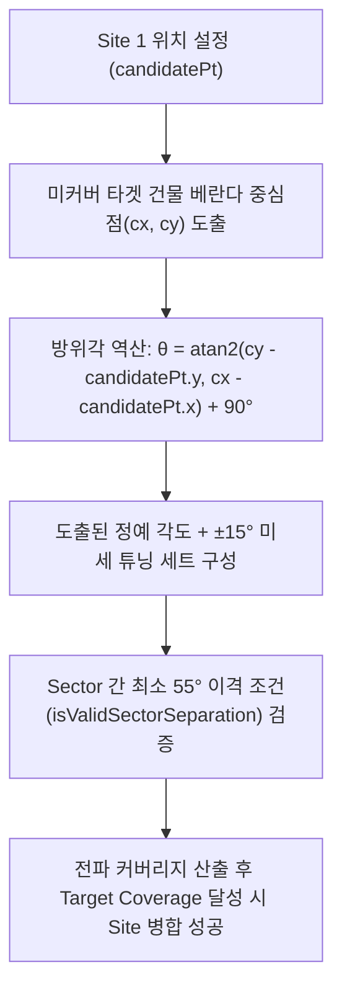
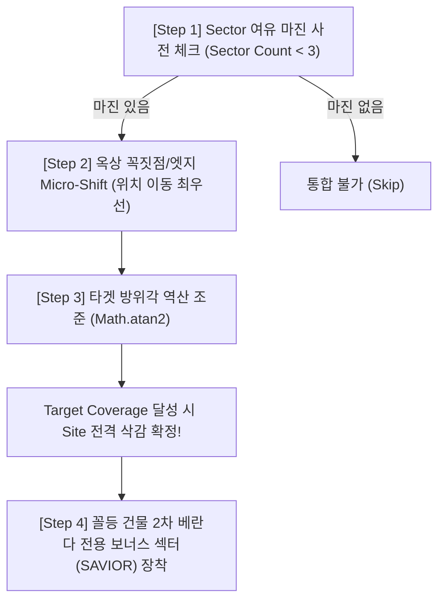

# Site 다이어트(Consolidation & Minimization) 알고리즘 정수 (Core Essence)

> **문서 작성 정보**  
> - **작성일**: 2026년 7월 28일  
> - **작성 목적**: Greedy Forward 탐색 이후 수행되는 Site 축소 및 다이어트(YW-BiGreedy Engine) 알고리즘의 핵심 철학, 3단계 마이너스 엔지니어링 일반화 규칙, 수학적/기하학적 구조, 및 성능 최적화 가이드라인 정립

---

## 1. 알고리즘 배경 및 본질적 목적 (Context & Purpose)

### ① Greedy Forward 탐색의 한계
* **Forward Greedy 탐색**은 미커버 1차 베란다를 가장 많이 커버하는 위치에 순차적으로 Site 및 Sector를 꽂는 방식입니다.
* 이 방식은 개별 건물의 커버리지를 빠르게 확보하지만, **건물별로 독립된 Site가 각각 하나씩 생성되는 과도한 투입(Over-provisioning) 현상**을 초래합니다.

### ② 역방향 Site 다이어트(Site Minimization)의 목표
* Forward 탐색 완료 후, **"최소의 Site 수량(CAPEX 삭감)으로 전체 1차 베란다 목표 커버리지(Target Coverage %)를 완벽히 유지하는 것"**이 다이어트 로직의 본질입니다.

---

## 2. 현장 RF 실무 Ground Truth (Core Rationale)

1. **1차 베란다 100% 모수 보존의 법칙**:
   * Site를 통합/삭감할 때 1차 베란다 커버 미터수(m)가 목표치 이하로 손실되어서는 안 됩니다.
   * 2차 베란다는 +70% 부가 가점일 뿐이며, 2차 베란다 점수를 얻겠다고 1차 베란다가 손실되는 Site 삭감은 절대 허용되지 않습니다.

2. **자기 건물 차폐 제약 (Rule 9)**:
   * 장비가 건물 옥상에 배치되는 경우 해당 건물 벽면에 차폐되지 않지만, 자신이 속한 건물 자체는 직접 서비스 대상에서 제외(또는 차폐 케이스 분리)됩니다.

3. **안테나 빔폭 및 이격 제약 (Rule 11)**:
   * 안테나 빔폭 65° 기준 동일 Site 내 Sector 간 센터각은 최소 55°~60° 이상 이격되어야 합니다 (최대 5° 중첩 허용).

---

## 3. 핵심 알고리즘 철학: Target-Driven Vector Geometry

### ❌ 잘못된 접근: Angle-First Grid Search (무작위 각도 헛발질 탐색)
* 0°, 30°, 60° 등 정해진 간격으로 안테나 빔을 무작위로 쏴보는 방식은 다음과 같은 치명적 문제를 유발합니다:
  * 핀포인트 지향각(예: 340°, 161°, 75°, 286° 등)을 놓쳐 **커버리지 미달로 인한 불필요한 Site 유지**.
  * 다중 중첩 루프에 의한 **연산 폭발 (Computational Explosion) 및 브라우저 프리징**.

### ⭕ 정답 알고리즘: Target-Driven Vector Geometry (역방향 방위각 도출)
컴퓨터가 임의로 빔을 쏴보는 것이 아니라, **엔지니어의 공간 직관을 기하학적으로 역산**합니다.

---

## 4. 마이너스 엔지니어링 3단계 시퀀스 일반화 (Minus Engineering Sequential Rules)

Site 다이어트(통합 및 삭감)를 수행할 때 아래 **3단계 엄격한 정밀 시퀀스**를 반드시 순서대로 적용합니다:

### [Step 1] Sector Slot Margin Check (여유 슬롯 사전 검증)
* **일반화 규칙**: 흡수하려는 살아남은 사이트(`adjSite`)의 현재 Sector 개수를 확인합니다 (최대 3개 제약).
* `Sector Count >= 3`인 경우, 추가 장비를 설치할 보상 여유 슬롯이 없으므로 해당 사이트로의 통합은 **원천 불가 (Immediate Pruning Skip)** 처리합니다.

### [Step 2] Rooftop Vertex/Edge Micro-Shift (위치 이동 최우선)
* **일반화 규칙**: 여유 슬롯 마진이 존재할 경우, **방향 조준에 앞서 위치 이동(Micro-Shift)을 최우선으로 실행**합니다.
* **이동 방향**: 사라진 사이트(`victimSite`) 위치를 고려하여 기존 사이트(`adjSite`) 건물 옥상 다각형 경계(`pointInPolygon` / `snapToPolygonEdge`) 및 **모서리 꼭짓점(Corner Vertex)으로 이동**합니다.
* **사례**: Building #2 옥상 좌측 끝 `(300, 500)`에서 동남단 모서리 꼭짓점 `(400, 529)`로 다가가 시야각(LOS Window)을 최대로 확보합니다.

### [Step 3] Target Vector Azimuth Aiming (이동 완료 후 방향 조준)
* **일반화 규칙**: 위치 이동이 완료된 후, 해당 신규 위치(`candidatePt`)에서 미커버 타겟 건물 베란다 중심(`cx, cy`)을 향하는 방위각을 실시간 동적 역산합니다:
  $$\theta = \text{atan2}(cy - \text{candidatePt.y}, cx - \text{candidatePt.x}) + 90^\circ$$
* 도출된 조준각(예: Building #4를 겨냥하는 `65°`, 건물 1을 겨냥하는 `330°`)을 적용하여 커버리지를 평가하고, 목표 커버리지(Target Coverage %) 달성 시 Site 삭감을 확정합니다.

### [Step 4] Worst Building 2nd Veranda Savior Sector (꼴등 건물 보너스 섹터 반영)
* **일반화 규칙**: 메인 1차 커버리지 조준 및 Site 다이어트가 완수된 후, 2차 베란다 커버 수율이 가장 낮은 **꼴등 건물(Worst Building)**을 식별합니다.
* 꼴등 건물을 지향할 수 있는 위치의 살아남은 사이트에 Sector 여유 슬롯(Sector < 3개)이 남아있다면, **2차 베란다 가점 커버 전용 보너스 섹터(`SAVIOR Sector`, 예: M-1-C 166°)**를 추가 배치하여 품질을 최종 마무리합니다.

---

## 5. 건물 다각형 락 기반 이동 (Building-Bound Micro-Shift)

1. **Step-wise Interpolation & Roof Edge Attractor**:
   * Site 1이 Site 2를 흡수하기 위해, Site 1 건물의 옥상 테두리를 따라 움직이거나 Site 2 방향으로 다가가는 보행점(Interpolation Step Points)을 생성합니다.

2. **건물 다각형 경계 락 (Building Boundary Lock)**:
   * **절대 원칙**: 장비는 허공이나 길거리에 설치될 수 없으므로 무조건 자신의 건물 옥상 내부 다각형(`pointInPolygon`)에 위치해야 합니다.
   * 다가가는 가상 좌표가 건물 밖으로 튀어나갈 경우 **건물 옥상 테두리선(`snapToPolygonEdge`)으로 강제 스냅(Snap)**하여 경계 밖 유출을 엄격히 차단합니다.

---

## 6. 연산 복잡도 및 성능 최적화 (Performance Optimization)

### ① 연산 병목 원인
* 이동점 수 ($M$) × 각도 조합 수 ($N$) × 전파 3D Ray-Casting 연산이 중첩되어 연산량이 $O(M \times N \times \text{RayCount})$ 로 폭발함.

### ② 향후 최적화 가이드라인 (Roadmap for Speed Optimization)
1. **사전 조합 프리셋 (Pre-computation)**:
   * candidatePt 루프 외부에서 유효 각도 조합을 1회만 사전에 생성하여 중복 계산 방지.
2. **Ray-Caster 셀프 차폐 방지 (`isCandidate: true`)**:
   * 옥상 테두리점 상의 출발 전파 레이가 자기 건물 벽면에 0.001px로 부딪혀 0점 처리되는 오류를 방지하기 위해 `isCandidate: true` 플래그 명시 필수.
3. **Bounding-Box Pruning (조기 차단)**:
   * 안테나 빔의 최대 사거리(`maxRange`) 밖이나 가림막 건물 다각형 뒤편에 완전히 가려진 샘플은 전파 연산에서 제외(Early Exit).

---

## 7. 결론 요약

이 정수(Essence) 문서는 **Brute-force Trial & Error 방식을 배제하고, 마이너스 엔지니어링 3단계 시퀀스(Sector 마진 체크 ➔ 위치 이동 ➔ 방위각 역산 ➔ 꼴등 건물 보너스 섹터 반영)와 건물 다각형 락(Building Boundary Lock)을 결합하여 최소의 CAPEX로 최고의 커버리지를 달성하는 RF 설계 최적화 표준 명세**입니다.
