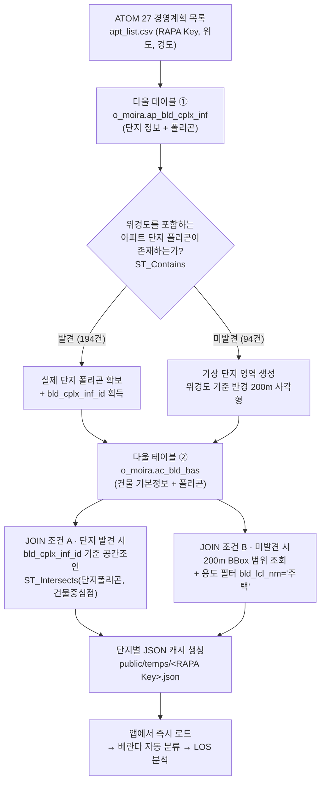
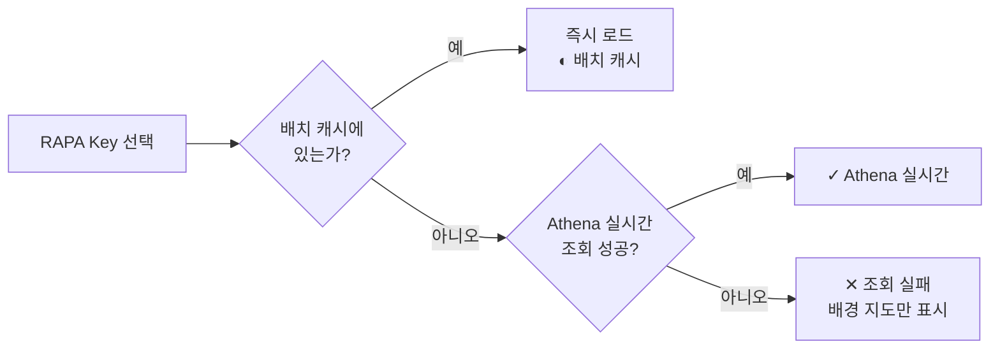

# 27년 경영계획 대상 전체 DB화 및 분석 세팅

> **문서 목적**: 27년 경영계획 아파트 전체를 분석 가능한 상태로 만들기 위해, ATOM 대상 목록에서 출발해 다울(MOIRA) 공간 DB의 **단지 폴리곤 → 건물 폴리곤**을 공간조인으로 확보한 과정과 그 결과를 설명한다.
> **대상 코드**: `athena/query_moira.py`, `server.ts`, `src/lib/moiraPolygon.ts`
> **산출물**: `public/temps/<RAPA Key>.json` × 288
> **작성 기준일**: 2026-08-16

---

## 1. 배경 — 분석을 시작조차 할 수 없었던 이유

RF LOS 분석의 입력은 **단지 경계**와 **동별 건물 폴리곤**이다. 이게 없으면 아무것도 못 한다.

문제는 ATOM의 경영계획 목록에는 **아파트 이름·주소·위경도만** 있고 **도형 정보가 전혀 없다**는 점이었다.

기존 방식대로라면 실무자가 단지 하나마다:

```
① 위경도로 지도에서 단지 찾기
② 단지 경계를 눈으로 보고 손으로 그리기
③ 동별 건물 외곽을 하나씩 그리기 (한 단지에 수십 동)
④ 층수·높이를 별도 자료에서 찾아 입력
```

**대상이 282개 아파트다.** 단지당 30분만 잡아도 140시간이 넘고, 손으로 그린 도형은 실제 좌표와 다르므로 **거리 기반 RF 계산의 신뢰도가 처음부터 깨진다.**

**해결 방향은 명확했다 — 손으로 그리지 말고, 이미 존재하는 공간 DB에서 정확한 도형을 긁어온다.**

---

## 2. 대상 범위 확정

ATOM 27년 경영계획 목록(`apt_list.csv`)을 정리한 결과:

| 구분 | 건수 |
|---|---|
| 전체 대상 (전부 2027 사업년도, RAPA 식별코드 고유) | **299** |
| └ 아파트 유형 (`아파트` 155 + `500세대 미만` 79 + `500세대 이상` 48) | **282** |
| └ 그 외 (`일반` 9, `아파트(인빌딩)` 3, `다중` 2, `미만+다중` 2, `인빌딩` 1) | 17 |

**본부별 분포**: 수도권 170 · 중부 47 · 동부 46 · 서부 36

→ **분석 목표 모수 = 아파트 282개**로 확정.

---

## 3. 처리 파이프라인

### 3.1 전체 흐름



### 3.2 단계별 상세

#### ① 단지 폴리곤 조회 — 다울 테이블 1

```sql
SELECT bld_cplx_inf_id, cplx_type_div_id, cplx_lcl_nm, cplx_mcl_nm, cplx_scl_nm,
       ST_AsText(ST_GeomFromBinary(pygn_geo)) AS wkt
FROM   o_moira.ap_bld_cplx_inf
WHERE  cplx_mcl_nm = '아파트'
  AND  ST_Contains(ST_GeomFromBinary(pygn_geo), ST_Point(<경도>, <위도>))
LIMIT 1
```

ATOM의 위경도 한 점이 **어느 아파트 단지 폴리곤 안에 들어가는지**를 공간 포함 연산으로 찾는다.
이때 얻는 `bld_cplx_inf_id`가 다음 단계의 조인 키가 된다.

#### ②-A 단지를 찾은 경우 — 건물 공간조인 (다울 테이블 2)

```sql
SELECT b.ciss_bld_cd, b.bld_nm, b.bld_lcl_nm, b.bld_scl_nm,
       b.grud_flor_cnt, b.bsmt_flor_cnt, b.bld_hght,
       b.bld_in_lng, b.bld_in_lat,
       ST_AsText(ST_GeomFromBinary(b.geo)) AS wkt
FROM   o_moira.ap_bld_cplx_inf c
JOIN   o_moira.ac_bld_bas      b
  ON   ST_Intersects(ST_GeomFromBinary(c.pygn_geo), ST_Point(b.bld_in_lng, b.bld_in_lat))
WHERE  c.bld_cplx_inf_id = '<단지ID>'
```

**단지 폴리곤 안에 중심점이 들어가는 건물만** 가져온다 → 옆 단지 건물이 섞이지 않는다.

#### ②-B 단지를 못 찾은 경우 — 가상 영역 폴백

신축 단지는 아직 단지 폴리곤이 등재되지 않은 경우가 있다. 이때 조회를 포기하지 않고, **위경도 기준 반경 200m 사각형을 가상 단지 영역으로 생성**하고 같은 범위의 건물을 조회한다.

```sql
SELECT ... FROM o_moira.ac_bld_bas
WHERE bld_in_lng BETWEEN <경도−0.0018> AND <경도+0.0018>
  AND bld_in_lat BETWEEN <위도−0.0018> AND <위도+0.0018>
  AND bld_lcl_nm = '주택'
```

가상 영역에는 주변 건물이 섞일 수 있으므로 **용도 필터(`주택`)를 추가**로 걸었다.

#### ③ 산출물 스키마

```jsonc
{
  "rapaKey": "m-RAPA-2303-0883",
  "queriedAt": "2026-...Z",
  "complex": {
    "bld_cplx_inf_id": 12345,        // 가상영역이면 null
    "cplx_scl_nm": "○○아파트",       // 가상영역이면 "가상영역(200m)"
    "polygon": [[lon, lat], ...]
  },
  "buildingSource": "complex_polygon",   // 또는 "virtual_200m_bbox"
  "buildings": [
    {
      "ciss_bld_cd": "...",
      "bld_nm": "101동",
      "floors_above": 25,   // 지상층수 — 저층 부속동 판별에 사용
      "floors_below": 2,
      "height": 74.5,
      "center": [lon, lat],
      "polygon": [[lon, lat], ...]
    }
  ]
}
```

`floors_above`(지상층수)를 함께 가져온 것이 중요하다. 이 값으로 **아파트 본동과 상가·경비실 등 저층 부속동을 구분**해 분석 대상을 자동으로 걸러낼 수 있다.

---

## 4. 조회 결과

### 4.1 확보 현황

| 구분 | 건수 | 비고 |
|---|---|---|
| **캐시 확보 단지** | **288** | `public/temps/*.json`, 총 11 MB |
| └ 실제 단지 폴리곤 확보 | **194 (67.4%)** | `buildingSource: complex_polygon` |
| └ 가상 영역(200m) 대체 | **94 (32.6%)** | `buildingSource: virtual_200m_bbox` |
| 아파트 목표 모수 282 중 확보 | **274 (97.2%)** | 미확보 8건 |
| 전체 299 중 미조회 | 11 | KT/LG/SK 계열 코드 6건 + RAPA 5건 |

### 4.2 확보한 데이터 규모

| 항목 | 수량 |
|---|---|
| 전체 건물 | **15,228동** |
| └ 아파트급 (지상 5층 이상) | **3,430동** |
| └ 저층 부속동 (지상 2층 이하) | 9,303동 |
| 폴리곤 결측 | **0동** |
| 단지 폴리곤 밖 건물 (오조인 검증) | **0동** |

> **오조인 검증**: 확보한 15,228동 전부에 대해 건물 중심점이 소속 단지 폴리곤 내부에 있는지 재검사한 결과 **외부 0건**. 공간조인이 의도대로 동작했음을 확인했다.

---

## 5. 운영 구조 — 캐시 우선 + 실시간 폴백

다울(Athena)은 사내망에서만 접근 가능하다. 그래서 앱은 2단 구조로 동작한다.



| 실행 모드 | 용도 | 특징 |
|---|---|---|
| `batch` | 전체 목록 일괄 조회 → 정적 JSON 캐시 생성 | 진행률 표시, 한 번 돌려두면 사내망 밖에서도 사용 가능 |
| `single` | 캐시에 없는 키만 실시간 조회 | Node 서버가 `child_process`로 호출, stdout에 JSON 1줄 |

**실패를 감추지 않는다.** 폴리곤을 못 가져오면 다른 소스(VWorld 등)로 조용히 대체하지 않고, **명시적으로 실패 배지를 띄우고 배경 지도만 표시**한다. 27년 실전 분석이므로 **잘못된 데이터로 조용히 계산되는 것이 조회 실패보다 위험**하기 때문이다.

### 5.1 편집 결과 되돌려쓰기

조회된 폴리곤이 실제와 다르면 앱에서 수정하고 **DB 저장**으로 원본 JSON에 반영할 수 있다.

- 최초 저장 시 `public/temps/_backup/`에 원본 자동 백업 → **복원 가능**
- 인덱스가 아닌 **기하 기반 매칭**으로, 편집하지 않은 건물은 원본 위경도를 그대로 보존 (좌표 왕복 오차 없음)

---

## 6. 효과

| 항목 | 이전 (수작업) | 현재 |
|---|---|---|
| 단지 도형 확보 | 지도 보고 직접 그리기 | **282개 중 274개 자동 확보 (97.2%)** |
| 건물 도형 확보 | 동별로 직접 그리기 | **15,228동 자동 확보, 결측 0** |
| 층수·높이 | 별도 자료 수기 입력 | 건물 DB에서 함께 조회 |
| 좌표 정확도 | 손으로 그린 근사치 | **다울 공간 DB 원본 좌표** |
| 소요 시간 (추정) | 단지당 30분 × 282 ≈ 140시간+ | 배치 1회 실행 |
| 재현성 | 작업자마다 다름 | 동일 쿼리 → 동일 결과 |

이 데이터가 확보되었기 때문에, 이후 단계인 **베란다 자동 분류(3,430동 전수 검증)**와 **LOS 커버리지 분석**이 가능해졌다.

---

## 7. 알려진 한계와 후속 과제

| # | 한계 | 영향 | 대응 |
|---|---|---|---|
| 1 | **가상 영역 94건(32.6%)** — 단지 폴리곤 미등재 | 주변 건물이 섞일 수 있음 (용도 필터로 완화) | 등재 후 재조회 / 앱에서 경계 직접 편집 |
| 2 | 가상 영역의 경도 버퍼에 **cos(위도) 보정 없음** | 남북 약 401m인데 동서는 약 328m (위도 35~38°에서 0.82배) | 재배치 시 보정 적용 |
| 3 | 미확보 11건 (KT/LG/SK 계열 코드 6건 포함) | 해당 단지 분석 불가 | 코드 체계 확인 후 재조회 |
| 4 | 단지 폴리곤 조회 시 `cplx_mcl_nm = '아파트'` 고정 | 아파트로 분류되지 않은 대상은 미발견 처리 | 유형별 필터 확장 검토 |
| 5 | 단지 경계 걸침 건물 | 현행 캐시는 **버퍼 없이** 엄격 포함(외부 0건) | 필요 시 150m 버퍼 옵션으로 재조회 가능 (스크립트 지원됨) |
| 6 | 폴리곤 중복 | 전수 스캔 시 겹치는 건물 쌍 486쌍 / 829동 / 135단지 검출 | 정합성 정리 대상 |
