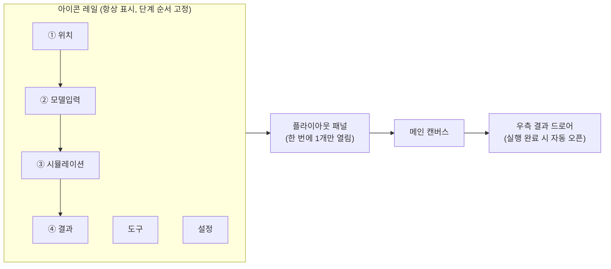

# RF LOS 시뮬레이터 — UI/UX 및 메뉴 구조 개편

> **문서 목적**: 도구를 쓰는 실무자 관점에서, 같은 분석을 **더 적은 조작 · 더 적은 재작업 · 더 높은 신뢰**로 끝낼 수 있도록 무엇을 바꿨는지 설명한다.
> **대상 코드**: `src/App.tsx`, `src/index.css`
> **작성 기준일**: 2026-08-16

---

## 1. 배경 — 무엇이 문제였나

이 도구는 "아파트 단지의 베란다(창) 위치를 파악하고, RF 장비를 어디에 몇 개 놓아야 커버리지가 나오는가"를 계산한다.
그런데 초기 화면은 **기능을 나열한 구조**였고, 실무자가 실제로 밟는 순서(① 대상 찾기 → ② 모델 만들기 → ③ 돌리기 → ④ 결과 보기)와 화면 구성이 일치하지 않았다.

그 결과 세 가지 비효율이 반복됐다.

| 구분 | 증상 | 실무 영향 |
|---|---|---|
| **탐색 비용** | 단지를 고르려면 본부/시도/읍면동 드롭다운 3개를 순서대로 조작 | 단지 하나 바꿀 때마다 3~4클릭 |
| **재작업** | 리셋해도 이전 단지의 폴리곤 잔재가 캔버스에 남음, 도구가 해제되지 않아 원치 않는 클릭이 도형이 됨 | 잘못 그린 것을 지우고 다시 시작 |
| **결과 불신** | 화면의 축척을 알 수 없어 "이 거리가 몇 m인가"를 판단 못 함 | LOS 결과를 믿을 근거가 없음 |

**개편의 원칙은 하나다 — 사용자가 "지금 어디에 있고, 다음에 무엇을 하면 되는지"를 화면이 알려줄 것.**

---

## 2. 작업 동선 재설계

### 2.1 이전 구조

```
[상단 탑바: 검색 + 필터3개 + 줌 + 로그 + 새로고침 …]
[좌측 사이드바: 모든 설정이 한 화면에 세로로 나열]
[캔버스]
[우측: 결과]
```

기능이 어느 단계에 속하는지 화면상 구분이 없어, 처음 쓰는 사람은 무엇부터 눌러야 할지 알 수 없었다.

### 2.2 개편 구조 — 아이콘 레일 + 플라이아웃 + 결과 드로어



- **레일이 곧 작업 순서**다. 위→아래가 ①위치 → ②모델입력 → ③시뮬레이션 → ④결과 순으로 고정돼 있어, 화면만 봐도 절차를 알 수 있다.
- **한 번에 한 패널만 열린다.** 설정이 전부 펼쳐져 있던 이전과 달리, 지금 단계에 필요한 것만 보인다.
- **결과는 별도 드로어**로 분리해 캔버스를 가리지 않는다. 시뮬레이션이 끝나면 자동으로 열린다.

---

## 3. 항목별 개선 내역

### 3.1 탐색 — 대상 단지를 빨리 찾기

| 항목 | 이전 | 개편 | 사용자 이득 |
|---|---|---|---|
| 지역 필터 | 본부/시도/읍면동 `<select>` 3개가 상단에 상시 노출 | **필터 버튼 1개 → 팝오버**로 통합 | 상단바 공간 확보, 필터를 안 쓸 땐 시야에서 사라짐 |
| 단지 검색 | 드롭다운을 스크롤해서 찾음 | **RAPA Key 검색창** 추가 (입력 즉시 후보 필터링) | 코드를 아는 경우 즉시 도달 |
| 줌 조절 | 상단바에 슬라이더 상주 | **캔버스 우상단 오버레이 칩**으로 이동 | 조작 대상(지도) 옆에 컨트롤 배치 |

> RAPA Key 검색 드롭다운은 상단바가 `overflow-y:hidden`으로 잘리는 문제가 있어, `createPortal` + `position:fixed`로 렌더해 잘림 없이 표시되도록 처리했다.

### 3.2 조작 상태 일관성 — "왜 이게 그려졌지?"를 없애기

| 문제 | 원인 | 조치 |
|---|---|---|
| 그리기 도구가 해제되지 않음 | 도구 버튼에 토글 동작 없음 | 같은 버튼 재클릭 시 `idle` 복귀 + **Esc 전역 단축키** |
| 리셋 후에도 이전 단지 경계가 남음 | 캔버스 draw `useEffect` 의존성 배열에 `analysisArea`, `concreteWalls`, `rulerLine`, `mode`, `theme` 누락 + `clearDrawing()`이 해당 상태를 초기화하지 않음 | 의존성 보강 + 초기화 로직 수정 (재발 방지 주석 명시) |
| 결과 패널이 특정 조건에서 오류 | `result`가 없는 상태 접근 | TypeScript `strict` 활성화 후 4곳 null 가드 추가 |

### 3.3 캔버스 가독성 — 지도 위에서도 읽히게

배경 지도 타일은 단지마다 밝기가 제각각이다. 측정 결과 기존 데이터 선의 대비는 **일반 지도 2.87:1 / 위성 2.32:1** 로, 최소 기준 3:1에 미달했다.

색만으로는 해결되지 않으므로 **케이싱(casing)** 기법을 도입했다 — 색선 아래에 어두운 테두리를 한 겹 먼저 깔고 그 위에 색을 얹는 카토그래피 관행이다.

```
  [케이싱: 어두운 굵은 선]  ←  타일 밝기와 무관하게 형태를 확보
  [데이터: 색상 선]        ←  그 위에 얇게
```

추가로:

- **1차/2차 베란다**를 별개 색이 아니라 **같은 색상의 두 밝기 단계**로 표현 (등급 관계를 색으로 드러냄)
- **콘크리트 벽은 무채색** — 데이터가 아니라 배경 정보이므로 시선을 뺏지 않게
- 선 두께를 CSS 토큰(`--d-w1/w2/w-c`)으로 빼서 한 곳에서 톤 조절 가능

### 3.4 장비 사이트 구분 — 색만으로는 부족하다

사이트 수에 상한이 없는데 색상 팔레트는 유한하다. 색각이상(CVD) 시뮬레이션으로 검증한 결과:

| 사이트 수 | 기존 팔레트 최소 색차(ΔE) | 판정 |
|---|---|---|
| 5개 이하 | 8.3 (CVD) / 18.6 (일반) | 양호 → **유지** |
| 6개 | 5.4 | 구분 어려움 |
| 10개 | 1.3 | 사실상 동일색 |

→ 슬롯 1~5는 그대로 두고 **6~10번만 교체**(wine/bronze/jade/sky/deep blue)했으며, 근본적으로는 **라벨에 사이트 번호를 병기**(`3-A` 형식)해 색에 의존하지 않고도 식별되게 했다.

### 3.5 축척 신뢰 — 이번 개편의 핵심

**문제**: 화면에서 50m가 몇 픽셀인지 알 수 없었다. 이는 미관 문제가 아니라 **계산 정확도 문제**다 — LOS 시뮬레이션은 `거리(m) = 픽셀거리 ÷ pixelsPerMeter`로 도달 여부를 판정하기 때문이다.

전수 288개 단지를 측정한 결과, 캔버스 투영이 경도·위도를 각각 화면 폭·높이에 **독립적으로** 정규화하고 있어 가로와 세로의 축척이 달랐다.

| 지표 | 개선 전 | 개선 후 |
|---|---|---|
| 가로/세로 축척 불일치 25% 초과 단지 | **242 / 288 (84%)** | 0 |
| 실제 벽면 거리 오차 (4,861개 표본) | 중앙 13.8% · p90 40.9% · 최대 60.3% | **중앙 0.000% · 최대 0.000%** |
| 축척값 설정 | 기본값 2 고정 (실제 필요값 0.90~9.00) | **단지별 자동 산출** |

**조치 3가지**

1. **투영 등방화** — 캔버스 크기를 단지 bbox의 실제 미터 종횡비에 맞춰 결정. 화면 활용도 손실 없음(세로 표시 배율 중앙값 1.000배 유지).
2. **자동 축척 적용** — 단지 로드 즉시 픽셀/미터를 계산해 반영하고 팝업으로 통지.
   > **Scale Ruler : 50m 자동 축척 적용** — `50m = 105px (2.110 px/m)`
3. **상시 축척 바** — 캔버스 좌하단에 축척 바를 그려, 팝업이 사라진 뒤에도 언제든 거리 감각을 확인할 수 있게. 화면 폭의 30% 이내에 들어오는 단위(5/10/20/25/50/100/200…m)를 자동 선택.

계산이 불가능한 경우(이미지 배경 업로드 등)에는 **수동 보정을 안내**한다.
> **Scale Ruler : 자동 축척 불가 — 수동 보정 필요**

> 참고: 축척 안내는 일반 알림과 **별도 슬롯**에 표시한다. 초기 구현에서는 공용 알림 슬롯 1개를 공유해, 뒤늦게 완료되는 배경 지도 로드 알림에 덮여 사라지는 문제가 있었다.

### 3.6 데이터 보존 — 편집 결과를 잃지 않기

| 기능 | 설명 |
|---|---|
| **DB 저장** | 편집한 건물 폴리곤을 원본 `public/temps/<RAPA Key>.json`에 반영. 최초 저장 시 `_backup/`에 원본 자동 백업 |
| **DB 복원** | 백업본으로 되돌리기 |
| 매칭 방식 | 인덱스가 아닌 **기하 기반 매칭** — 편집 안 된 건물은 원본 위경도를 그대로 보존해 좌표 왕복 오차를 만들지 않음 |

기존 "Save Topology"(프로젝트 파일 내보내기)와 역할이 다르므로, **도구 탭에서 두 기능을 인접 배치하고 설명 문구로 구분**했다.

### 3.7 시각 체계 정리

| 항목 | 이전 | 개편 |
|---|---|---|
| 디자인 토큰 | `@theme`(다크·시안) + `--shell-*`(크림·앰버) **2개 체계 병존** | **단일 토큰 체계**. Tailwind의 zinc/gray 스케일을 새 토큰으로 리맵해, 기존 JSX 클래스 100여 곳을 수정하지 않고 일괄 반영 |
| 테마 | 다크 고정 | **다크/라이트 토글** (웜 뉴트럴 계열 — 지도 타일과 같은 색조) |
| 폰트 | 5종 | **2종** (IBM Plex Sans / Mono) |
| 모서리 반경 | 9단계 | **3단계** |

---

## 4. 사용자 관점 효과 요약

| 작업 | 이전 | 개편 후 |
|---|---|---|
| 단지 전환 | 드롭다운 3개 조작 + 스크롤 탐색 | 검색창에 코드 입력 (또는 필터 팝오버 1회) |
| 화면 거리 판단 | 불가 — 축척 미상 | 로드 즉시 자동 적용 + 상시 축척 바 |
| LOS 거리 계산 신뢰도 | 방향에 따라 최대 60% 오차 | 오차 0% |
| 리셋 후 재작업 | 잔재 제거 필요 | 잔재 없음 |
| 그리기 도구 해제 | 방법 없음 | 재클릭 또는 Esc |
| 편집 결과 보존 | 프로젝트 파일로만 | DB 직접 저장 + 백업/복원 |
| 사이트 6개 이상 구분 | 색상만 — 사실상 불가 | 번호 라벨 병기로 무제한 |

---

## 5. 남은 과제

- 라이트 테마는 토큰 정리 기준으로 대응했으나, 전 화면 육안 확인은 미완료
- 결과 대시보드(전체 리스트/Top-N 후보 표)는 다음 단계
- LOS 시뮬레이션 실행 시간(단지당 약 4.5~6분)은 별도 성능 과제로 분리 — 프로파일링 필요
