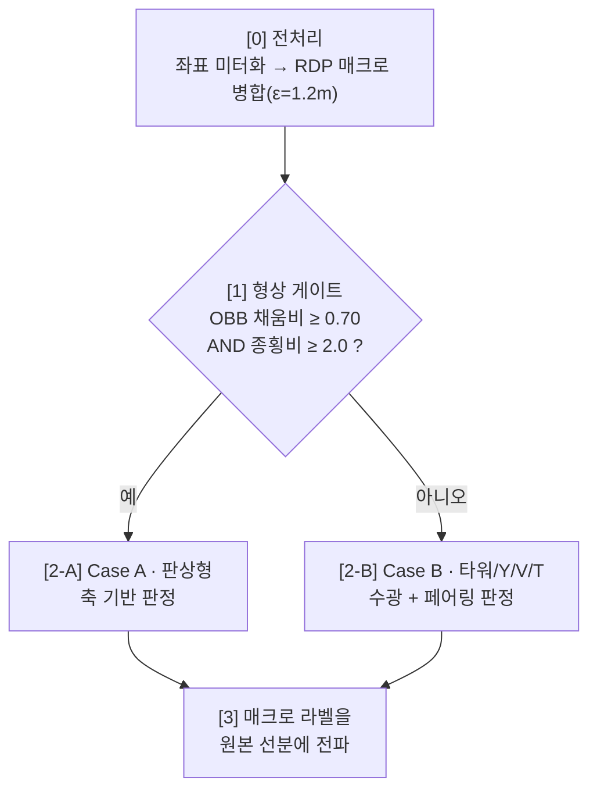
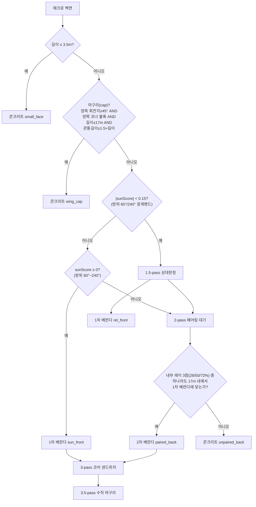

# 베란다 AI 자동 세팅 — 로직 정교화 / 고도화

> **문서 목적**: 건물 외벽을 1차 베란다 / 2차 베란다 / 콘크리트로 자동 분류하는 로직이 **왜 필요했고, 어떤 원리로 동작하며, 어떻게 정확도를 끌어올렸는지**를 순서대로 설명한다.
> **대상 코드**: `src/lib/verandaAi.ts` (`classifyBuildingWalls`)
> **작성 기준일**: 2026-08-16

---

## 1. 배경 — 왜 자동화가 필요한가

RF LOS 분석은 **전파가 실내로 들어가는 경로(창·베란다)**를 기준으로 커버리지를 계산한다.
따라서 분석 전에 "이 건물의 어느 벽면이 창이고, 어느 벽면이 콘크리트인가"를 지정해야 한다.

이걸 사람이 하면 어떻게 되는지 실제 규모로 계산해 보면:

| 항목 | 수량 |
|---|---|
| 27년 경영계획 대상 단지 | 288개 |
| 단지 내 전체 건물 | 15,228동 |
| 그중 아파트급(지상 5층 이상) | **3,430동** |
| 건물당 평균 외벽 매크로 면 | 약 15~25면 |

→ 아파트급만 따져도 **수만 개의 벽면을 사람이 하나씩 클릭해서 지정**해야 한다. 단지 하나에 수십 분, 전체로는 수백 시간 규모다.
게다가 사람이 하면 **판정 기준이 사람마다·날마다 달라져** 단지 간 비교가 불가능해진다.

**목표는 두 가지다 — 노가다를 없애고, 판정 기준을 하나로 고정할 것.**

---

## 2. 이 문제가 어려운 이유

분류에 쓸 수 있는 입력은 **건물 폴리곤 기하 + 방위각**뿐이다. 평면도도, 세대 배치도도 없다.

> "거실이 어느 쪽인가"는 본질적으로 **건축 정보**인데, 그것을 **기하학으로 근사**하고 있다.

그래서 이 로직은 "정답을 계산"하는 게 아니라, **몇 가지 건축 상식을 기하 규칙으로 번역**한 것이다.

| 건축 상식 | 기하 규칙으로 번역 |
|---|---|
| 거실 전면은 남향을 향한다 | 벽면 법선의 방위각이 남남동(150°)에 가까울수록 1차 베란다 |
| 판상형은 전면/배면이 명확하다 | 건물이 길쭉하면(OBB 종횡비) 장축 양면을 전면/배면으로 배정 |
| 주방/다용도실은 거실 반대편에 있다 | 배면 벽에서 안쪽으로 광선을 쏴 세대 깊이(17m) 내에 1차 베란다가 마주 보면 2차 |
| 건물 끝단(마구리)에는 창이 없다 | 짧고 양쪽 코너가 볼록하며 안쪽 관통 깊이가 긴 면은 콘크리트 |

---

## 3. 처리 로직 — 전체 흐름

### 3.1 4단계 파이프라인



**[0] 전처리가 중요한 이유**: GIS 폴리곤은 실제 벽 하나가 미세한 요철로 수십 개 선분으로 쪼개져 있다.
그대로 판정하면 같은 벽면인데도 선분마다 1차/2차가 교차하는 결과가 나온다.
→ **RDP(Ramer–Douglas–Peucker) 알고리즘으로 1.2m 이내 요철을 하나의 '매크로 벽면'으로 병합**한 뒤, 매크로 단위로 판정하고 그 결과를 원본 선분에 되돌려준다.

### 3.2 Case A · 판상형 — 축 기반 (우선순위 순)

전제: OBB 장축의 두 법선 중 150°에 가까운 쪽 = **전면축**, 반대쪽 = **배면축**.

| 순위 | 조건 | 판정 | 사유 코드 |
|---|---|---|---|
| A1 | 전면축·배면축 어느 쪽과도 35° 초과로 틀어짐 | 콘크리트 | `end_wall` (마구리) |
| A2 | 길이 ≤ 3.5m | 콘크리트 | `small_face` (코어/설비 돌출) |
| A3 | 전면축에 더 가까움 | **1차 베란다** | `front_axis` |
| A4 | 나머지 | **2차 베란다** | `back_axis` |

판상형은 전면/배면이 구조적으로 명확하다는 가정 위에 있어 **페어링 검사를 하지 않는다.**

### 3.3 Case B · 타워/Y/V/T형 — 수광 + 페어링 (4패스)

사전 계산: 매크로마다 건물 **내부로 광선**을 쏴 마주 보는 면과 관통 깊이를 구한다. `sunScore = cos(방위각 − 150°)`.



**패스별 역할**

| 패스 | 하는 일 | 근거 |
|---|---|---|
| 1-pass | 미세면 · 마구리 · 명확한 수광면 확정 | 방위각 + 코너 형상 |
| 1.5-pass | 60°/240° 경계에 걸린 벽은 **마주보는 벽과 상대 비교**해 더 수광적인 쪽을 1차로 | 절대 문턱의 나이프엣지 제거 |
| 2-pass | 배면 벽이 세대 깊이(17m) 내에 1차 베란다를 마주 보면 **2차**, 아니면 콘크리트 | "2차 = 거실 맞은편"이라는 모델 |
| 3-pass | 콘크리트 사이에 낀 8m 이하 고립면 → 콘크리트 | 코어(계단실) 전면일 확률 |
| 3.5-pass | 긴 1차 벽에 **수직·볼록**으로 붙고 **뒤에 세대 깊이가 없는** 짧은 1차 → 콘크리트 | 스트립형 몸통의 세로 마구리 |

### 3.4 파라미터 일람 (전부 `VerandaAiOptions`로 조정 가능)

| 파라미터 | 기본값 | 역할 |
|---|---|---|
| `rdpEps` | 1.2 m | 요철 병합 허용 오차 |
| `slabFill` / `slabAspect` | 0.70 / 2.0 | 판상형 게이트 |
| `smallFace` | 3.5 m | 미세면 → 콘크리트 |
| `capTurn` / `capLenMax` / `capDepthRatio` | 45° / 17 m / 1.5 | 마구리 격리 |
| `sunAzimuth` | 150° | 최적 수광 방위 |
| `sunBand` | 0.0 | 1차 절대 문턱 |
| `relBand` | 0.15 | 경계 상대판정 밴드 |
| `depthMax` | 17 m | 페어링 세대 깊이 |
| `endWallAng` | 35° | 판상형 마구리 각 |
| `perpCap` | true | 수직 마구리 규칙 |

---

## 4. 고도화 과정 — 무엇을 어떻게 고쳤나

각 단계는 **실측 정답(GT) 확인 → 원인 진단 → 프로토타입 → 전수 회귀 → 시각 검증 → 적용** 순으로 진행했다.

### 4.1 v1의 근본 결함 (진단)

| # | 증상 | 근본 원인 | 규모 |
|---|---|---|---|
| ① | 판상형인데 짧은 마구리 면이 베란다로 잡힘 | 판상형 게이트 `R ≥ 0.6`이 **순수 직사각형 기준 종횡비 4:1과 수학적으로 등가** → 실제 판상형 대부분을 타워 로직으로 흘려보냄 | 판상형 감지 **59동** (실제 733동) |
| ② | 같은 벽면인데 선분마다 1차/2차 교차 | RDP 매크로 병합이 문서에는 있으나 **미구현** | 23건 |
| ③ | 방위각·종횡비가 단지마다 다르게 왜곡 | 캔버스 좌표가 경도/위도를 독립 정규화(비등방)한 상태로 각도 계산 | 전 단지 |
| ④ | 1m 미만 선분이 조용히 누락 | drop 처리 | 둘레 손실 |

### 4.2 개선 이력

| 버전 | 변경 내용 | 검증 결과 |
|---|---|---|
| **v2** | 미터화 보정 · OBB 게이트(fill+aspect) 교체 · RDP 병합 구현 · 마구리 격리 · 배면-전면 페어링 도입 | 판상형 감지 59 → **733동**<br/>증상① 614동 → **0동**<br/>증상③ 2,500동/40.8km → 1,660동/23.9km |
| **v2.1** | 히스테리시스 밴드 `0.10 → 0.0` 되돌림 + 페어링 광선 **1점 → 3점**(28/50/72%) | 방위 4° 차이로 동일 형상 건물이 갈리던 현상 해소 |
| **v2.2** | 경계 상대판정 `relBand = 0.15` 신설 | 방위 0.9° 지터로 동일 단지 내 같은 유형 건물이 1차↔콘크리트로 갈리던 문제 해소<br/>변화 **129동(3.8%)**, 기확정 GT **회귀 0** |
| **perp_cap** | 수직 마구리 3.5-pass 신설 | 실측 GT(Y형 몸통 측면) **5/5 적중**, 기확정 GT 회귀 0<br/>변화 1,010동(29.5%), 2차 베란다 총량 **불변** |

#### v2.2를 예로 든 진단 과정

특정 단지에서 **같은 유형 건물인데 동마다 왼쪽 장벽이 1차/2차/콘크리트로 제각각**이라는 지적이 있었다.

원인 추적 결과, 그 단지는 장벽 법선이 **239~241°** — 수광 스펙 경계(60°/240°, sunScore=0)에 정확히 걸친 배치였다.

```
b1 (239.59°, sunScore +0.0072) → 1차
b2 (240.47°, sunScore −0.0083) → 배면 → 마주보는 면(58.87°)도 배면
                                → 1차가 없어 페어링 실패 → 양쪽 모두 콘크리트
```

**건물 간 0.9°의 GIS 지터가 결과를 갈랐다.** 전수 스캔 결과 경계 ±2°에 15m 이상 장벽이 걸린 건물이 **115동(3.4%)/32개 단지** — 특이 케이스가 아니었다.

→ 절대 부호 대신 **마주보는 벽과 상대 비교**하도록 바꿔(`relBand`) 해소.

### 4.3 검증 체계

정확도를 주장하려면 검증이 재현 가능해야 한다. 4중으로 확인했다.


| 검증 항목 | 결과 |
|---|---|
| 전수 회귀 대상 | 288개 단지 / 아파트급 3,430동 |
| 형태별 커버리지 | 판상형 733동 · 타워/Y/V/T 2,697동 |
| TS ↔ Python 구현 일치 | **30/30** (판상형·V·T·Y 대표 4건 + 무작위 25건) |
| 실측 GT 회귀 | 확정 GT 건물 전부 **변화 없음** |

**3안 비교(적용 전 / 중간 / 최종)를 4개 형태 모두에 대해 실행**해, 판상형은 구조적으로 결과가 동일함(관련 코드 경로를 타지 않음)을 수학적·실측 양쪽으로 확인한 뒤 최종안을 확정했다.

### 4.4 최종 분류 분포 (아파트급 3,430동 전수)

| 구분 | 길이 | 비중 |
|---|---|---|
| 1차 베란다 | 170,233 m | 40.2% |
| 2차 베란다 | 129,346 m | 30.6% |
| 콘크리트 | 123,511 m | 29.2% |

---

## 5. 남은 트레이드오프 (솔직한 한계)

이 로직의 입력은 **폴리곤 기하 + 방위각**뿐이다. 근사를 하는 지점마다 한계가 하나씩 생긴다.

| # | 지점 | 증상 | 구조적 이유 |
|---|---|---|---|
| ⚖① | 형상 게이트 | 게이트 경계 건물이 A/B 어느 쪽으로 가느냐에 따라 결과가 달라짐 | 두 트리의 규칙이 이질적 |
| ⚖② | `sunAzimuth` 150° 고정 | 돌아앉은 건물은 "덜 남향인 쪽"이 2차가 됨 | **방위각이 유일한 1차 신호** |
| ⚖③ | `depthMax` 17m | 단축폭 18m 이상 건물은 배면이 콘크리트 | "2차 = 거실 맞은편" 모델의 물리 한계 (잔존 4동) |
| ⚖④ | `relBand` 0.15 | 밴드 안/밖에서 규칙이 바뀜 | 절대 문턱을 좁은 구간만 상대화한 절충 |
| ⚖⑤ | `rdpEps`/`smallFace` | 3.5m 이하 실제 창은 살릴 수 없음 | 코어·설비 돌출과 구분할 신호가 크기뿐 |

**개선 방향은 세 가지 중에서 고르게 된다.**
(a) 각 근사의 파라미터 튜닝 · (b) 새 신호 추가(단지 일관성·평면 DB·층수) · (c) 확신도 출력(경계 케이스를 사용자 확인 대상으로 표시)

---

## 6. 실무자가 확인하는 방법

- **검증 뷰어** (`/veranda_ai_viewer_v2.html`): 좌측 = 건물 원본, 우측 = 자동 분류 결과를 좌우 비교. 벽면에 마우스를 올리면 **판정 사유**(마구리/수광 전면/페어링 배면 등)와 방위각·길이가 표시된다.
- **앱 내 수정**: 자동 결과가 틀린 벽면은 직접 편집할 수 있고, DB 저장으로 반영된다. 즉 **자동 분류는 100%를 목표로 하는 게 아니라, 사람이 손볼 양을 수만 개에서 소수로 줄이는 것**이 목적이다.
