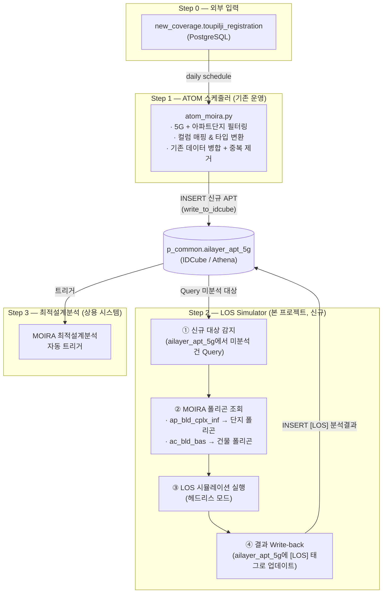

# 상용 배치 워크플로우 자동화 정리서

> **상태**: 분석 완료 / 개발 착수 전  
> **최종 업데이트**: 2026-08-08

## 이 문서를 언제 참조하는가

| 상황 | 참조 문서 |
|---|---|
| **전체 흐름이 뭔지 파악할 때** | ✅ **이 문서** (workflow_architecture.md) |
| Step 2 개발을 시작할 때 | [los_batch_spec.md](./los_batch_spec.md) |
| ATOM과 LOS 간 충돌 이슈 검토 | **이 문서** §3 핵심 설계 결정 |
| 관로동 로직 어떻게 구현할지 | [los_batch_spec.md](./los_batch_spec.md) Step 2.3~2.5 |
| 어떤 DB 컬럼이 연결되는지 | [db_schema_relations.md](./db_schema_relations.md) |

> **한 줄 정리**: 이 문서를 읽으면 **"뭘 만들어야 하는지"** 알 수 있습니다.  
> `workflow_architecture.md`(Why/What) → `los_batch_spec.md`(How) 순서로 읽으세요.  
> 두 문서는 **계층 관계**이지 중복이 아닙니다.

---

## 1. 전체 파이프라인 (End-to-End)



---

## 2. 단계별 상세 동작 정의

### Step 0: 투자필요지역 등록

| 항목 | 내용 |
|---|---|
| **소스** | `new_coverage.toupilji_registration` (PostgreSQL) |
| **접근** | SQLAlchemy + psycopg2 (환경변수: DBUSER, DBHOST, DBPORT, DBNAME) |
| **주체** | 현장/사업부가 수동 등록 |
| **트리거** | 사람이 등록하면 데이터 축적 |

### Step 1: ATOM 스케줄러 (기존 운영, [atom_moira.py](file:///Users/1109425/playground-eng-apt-cover-windows/extra/atom_moira.py) 기반)

| 순서 | 동작 | 코드 위치 |
|---|---|---|
| 1-1 | PostgreSQL에서 `toupilji_registration` 전체 조회 | [L35-43](file:///Users/1109425/playground-eng-apt-cover-windows/extra/atom_moira.py#L35-L43) |
| 1-2 | `service_category_minor == '아파트단지'` AND `network_type == '5G'` 필터 | [L76-77](file:///Users/1109425/playground-eng-apt-cover-windows/extra/atom_moira.py#L76-L77) |
| 1-3 | 원본 컬럼명 → `ailayer_apt_5g` 스키마 컬럼명으로 매핑 (66개 컬럼) | [L79-89](file:///Users/1109425/playground-eng-apt-cover-windows/extra/atom_moira.py#L79-L89) |
| 1-4 | dtype 일괄 변환 (string/int/double/Int64) | [L100-191](file:///Users/1109425/playground-eng-apt-cover-windows/extra/atom_moira.py#L100-L191) |
| 1-5 | 기존 `ailayer_apt_5g` 조회 → concat → 중복 제거 | [L200-203](file:///Users/1109425/playground-eng-apt-cover-windows/extra/atom_moira.py#L200-L203) |
| 1-6 | 기존 파티션 삭제 → 전체 재적재 | [L208-212](file:///Users/1109425/playground-eng-apt-cover-windows/extra/atom_moira.py#L208-L212) |

### Step 2: LOS Simulator (본 프로젝트 — 신규 개발 필요)

| 순서 | 동작 | 상태 |
|---|---|---|
| 2-1 | `ailayer_apt_5g`에서 **신규/미분석 대상** Query | 🔴 미개발 |
| 2-2 | 대상 아파트의 `lat`/`lng`로 MOIRA 테이블에서 폴리곤 조회 | 🔴 미개발 |
| 2-3 | 폴리곤 기반 LOS 시뮬레이션 (헤드리스) | 🟡 엔진 존재, 분리 필요 |
| 2-4 | 분석 결과를 `ailayer_apt_5g`에 `[LOS]` 태그로 Write-back | 🔴 미개발 |

### Step 3: 최적설계분석 (별도 상용 시스템)

- `ailayer_apt_5g` 데이터 갱신 시 자동 트리거 (본 프로젝트 범위 밖)

---

## 3. 핵심 설계 결정 사항 (확정)

### ✅ 결정 #1: 신규 대상 식별 방법

**방법**: 특정 날짜 이후 등록된 대상을 신규로 간주 + 분석 이력 관리

1. **최초 실행**: 특정 기준일(cutoff date) 이후의 `reg_dt`를 가진 레코드를 신규 대상으로 설정
2. **이후 실행**: LOS 분석 완료한 대상의 `ina_no`를 **별도 이력**으로 기록
3. **다음 turn**: `ailayer_apt_5g` 전체에서 이력에 없는 `ina_no`를 신규로 감지

```
신규 대상 = ailayer_apt_5g 전체 - LOS 분석 이력(ina_no 목록)
```

### ✅ 결정 #2: ATOM Full Refresh와 LOS 결과 공존 — `[LOS]` 태그 전략

**방법**: `smtso_nm` 컬럼에 `[LOS]` 태그를 붙여 ATOM 원본 레코드와 구분

- ATOM 원본: `smtso_nm = "래미안아파트"`
- LOS 결과: `smtso_nm = "[LOS] 래미안아파트"`

**안전성 검증 완료**:

| 검증 항목 | 결과 |
|---|---|
| `drop_duplicates` 방식 | **전체 66개 컬럼 기준** (subset 미지정) |
| `[LOS]` 태그 → 중복 제거 방지? | ✅ **안전** — `smtso_nm`만 달라도 중복 아님 |
| 태그 없어도 살아남는가? | ✅ `dt` 차이만으로도 중복 아님 |
| `[LOS]` 태그의 추가 효과 | 의미적 구분 + Query 시 필터링 용이 |

> [!NOTE]
> ATOM의 `drop_duplicates(keep='first')` ([L203](file:///Users/1109425/playground-eng-apt-cover-windows/extra/atom_moira.py#L203))는 `subset` 파라미터가 없어 **전체 컬럼 비교**합니다. `dt` 값이 항상 다르므로 사실상 대부분의 레코드가 중복으로 판정되지 않습니다. `[LOS]` 태그는 이 위에 추가 안전장치 역할을 합니다.

---

## 4. 셀프 검증: 확인된 사실 vs 가정

### ✅ 코드에서 확인된 사실

| # | 확인 사항 | 근거 |
|---|---|---|
| 1 | ATOM은 PostgreSQL에서 데이터를 가져옴 | [L38-43](file:///Users/1109425/playground-eng-apt-cover-windows/extra/atom_moira.py#L38-L43): `create_engine(postgresql+psycopg2)` |
| 2 | 아파트단지 + 5G만 필터링 | [L76-77](file:///Users/1109425/playground-eng-apt-cover-windows/extra/atom_moira.py#L76-L77) |
| 3 | 66개 컬럼 매핑 (var_list → cols) | [L79-86](file:///Users/1109425/playground-eng-apt-cover-windows/extra/atom_moira.py#L79-L86) |
| 4 | 기존 데이터와 concat 후 중복 제거 | [L200-203](file:///Users/1109425/playground-eng-apt-cover-windows/extra/atom_moira.py#L200-L203) |
| 5 | 전체 파티션 삭제 후 재적재 (full refresh) | [L208-212](file:///Users/1109425/playground-eng-apt-cover-windows/extra/atom_moira.py#L208-L212) |
| 6 | `dt` 파티션 키 = 실행일자 (YYYYMMDD) | [L15](file:///Users/1109425/playground-eng-apt-cover-windows/extra/atom_moira.py#L15), [L91](file:///Users/1109425/playground-eng-apt-cover-windows/extra/atom_moira.py#L91) |
| 7 | `ailayer_apt_5g`에 `lat`/`lng` 컬럼 존재 | [L114](file:///Users/1109425/playground-eng-apt-cover-windows/extra/atom_moira.py#L114), [L118](file:///Users/1109425/playground-eng-apt-cover-windows/extra/atom_moira.py#L118) |
| 8 | `drop_duplicates`는 전체 컬럼 비교 (subset 없음) | [L203](file:///Users/1109425/playground-eng-apt-cover-windows/extra/atom_moira.py#L203) |
| 9 | `[LOS]` 태그 전략은 중복 제거에 안전 | 분석 검증 완료 |

### ⚠️ 가정 (확인 필요)

| # | 가정 내용 | 리스크 |
|---|---|---|
| A | MOIRA 테이블이 Athena에서 동일하게 접근 가능 (`GetQuery_PandasCursor`로) | 스키마/접근 권한 미확인 |
| B | `ailayer_apt_5g`의 `lat`/`lng` 값이 MOIRA 테이블과 매칭 가능한 수준의 정밀도 | 좌표 오차 시 공간 조인 실패 |
| C | 최적설계분석이 `ailayer_apt_5g` 갱신을 자동 감지하여 트리거됨 | 트리거 방식 미확인 (polling? event?) |

---

## 5. 잠재적 이슈 & 리스크

### 🟡 Issue #1: password 환경변수 오류 (ATOM 기존 코드)

[L29](file:///Users/1109425/playground-eng-apt-cover-windows/extra/atom_moira.py#L29): `password = os.environ.get("DBUSER")` — **DBUSER**를 password로 사용 중.
올바른 코드: `password = os.environ.get("DBPASSWORD")` 또는 `"DBPASS"`

> [!WARNING]
> ATOM 기존 코드의 버그이지만, 현재 운영 중이라면 환경변수명 자체가 의도적일 수 있습니다. 확인 필요.

---

### 🟡 Issue #2: `drop_duplicates` 기준 컬럼 미지정 (ATOM 기존 코드)

[L203](file:///Users/1109425/playground-eng-apt-cover-windows/extra/atom_moira.py#L203): `df3.drop_duplicates(keep='first', inplace=True)` — **subset 미지정**으로 전체 컬럼 기준 중복 제거.
- `dt` 값이 항상 다르므로 사실상 dedup이 거의 작동하지 않음
- 의도적인 설계인지 확인 필요 (예: `ina_no` 기준으로 중복 제거해야 하는지)
- **LOS 프로젝트 관점에서는 이 특성 덕분에 `[LOS]` 태그 전략이 안전하게 동작함**

---

### 🟡 Issue #3: LOS 엔진 헤드리스 분리 난이도

현재 LOS 시뮬레이션은 `src/lib/simulation.ts`에 있으며 **TypeScript + Three.js 의존성**이 있습니다.
배치 모드에서 UI 없이 실행하려면:
- **Option A**: Node.js 환경에서 Three.js 없이 순수 기하학 계산만 분리 → 중간 난이도
- **Option B**: Python으로 LOS 엔진 재구현 (ATOM과 동일 환경) → 높은 난이도, but 운영 통일성 ↑
- **Option C**: Headless browser (Puppeteer)로 UI 포함 실행 → 낮은 난이도, but 비효율적

---

### 🟡 Issue #4: `ina_new_yn` 중복 할당 (ATOM 기존 코드)

[L69](file:///Users/1109425/playground-eng-apt-cover-windows/extra/atom_moira.py#L69)과 [L73](file:///Users/1109425/playground-eng-apt-cover-windows/extra/atom_moira.py#L73): `df['ina_new_yn'] = 0`이 **두 번** 할당됨. 기능상 문제 없으나 코드 정리 필요.

---

### 🟢 Issue #5: ATOM 실행 → LOS 실행 순서 보장

Daily batch에서 반드시 **ATOM 완료 후 LOS 실행**이 보장되어야 합니다.
- ATOM이 실패하면 LOS는 실행하면 안 됨
- 스케줄러에서 의존성 체인 설정 필요 (예: Airflow DAG, cron + 상태 파일)

---

### 🟢 Issue #6: MOIRA 테이블 접근 권한

`o_moira.*` 테이블은 현재 Athena/IDCube에서 **읽기 전용**일 가능성 높음.
- LOS Simulator가 이 테이블에서 데이터를 **읽기만** 하면 문제 없음
- 쓰기가 필요한 곳은 `p_common.ailayer_apt_5g`뿐 → 권한 확인 필요

---

## 6. 워크플로우 검증 결론

| 항목 | 판정 |
|---|---|
| 전체 파이프라인 흐름 | ✅ DONE |
| ATOM 동작 분석 | ✅ DONE |
| LOS Simulator 위치 | ✅ DONE — Step 2로 정의 |
| 신규 대상 감지 로직 | ✅ DONE — 날짜 기준 + 이력 관리 확정 |
| ATOM-LOS 결과 공존 | ✅ DONE — `[LOS]` 태그 전략 검증 완료 |
| 실행 순서 보장 | 🟡 스케줄러 설계 필요 |
| LOS 엔진 분리 | 🟡 구현 방식 결정 필요 |
