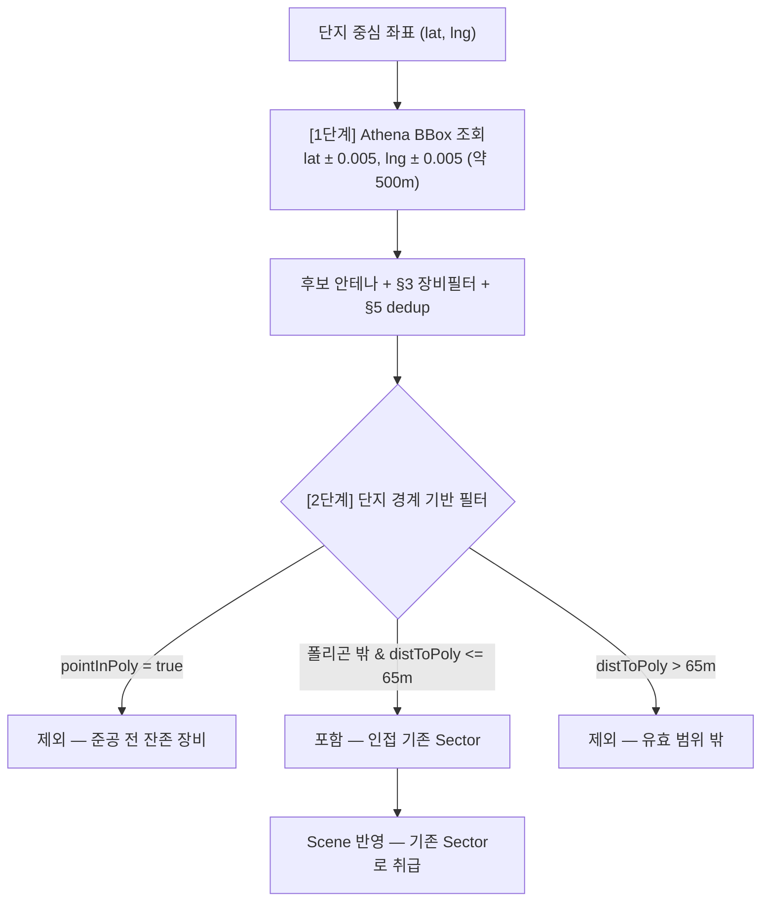

# 인접 무선 시설(안테나 자산) 연동 규격서

> **문서 상태**: v2 — 실데이터 검증 반영본
> **최초 작성**: 2026-08-26 (초안) / **개정**: 2026-08-26
> **대상 테이블**: `o_iam.celp_fgru_antenna`
> **검증 기준**: `dt = 20260826` 파티션, 328,978행, 44컬럼(전부 `varchar`)

---

## 0. 개정 이력 — 초안(v1)에서 정정된 것

| 항목 | v1 초안 (오류) | v2 확정 |
|:---|:---|:---|
| 테이블명 | `p_common.ant_remote_asset` | **`o_iam.celp_fgru_antenna`** |
| 방위각 | 컬럼 없음(미상) | **`tx_orient`** 존재, 0~360 |
| 좌표 | `lat`/`lng` (십진도 가정) | **`xpos`/`ypos`, DMS 문자열** → 변환 필수 |
| 조인 키 | `facility_cd`/`site_key` (추정) | `enb_id` / `sector` / `pci` / `portid` / `ant_seq` |
| 인빌딩 구분 | 미정 | 플래그 없음 → **`tx_ant` 장비명으로 판별** |
| 활용 방식 | 오버레이 표시 | **시뮬레이션 커버리지에 반영** (기존 Sector 취급) |
| 공간 필터 | 단지 내부 + 65m (건물과 동일) | **단지 내부 제외** + 외곽 65m 도넛 (§6) |

> [!WARNING]
> v1의 `p_common.ant_remote_asset`은 근거 없는 테이블명이었습니다. 이 문서를 참조하는 다른 문서/코드가 있으면 함께 정정해야 합니다.

---

## 1. 목적

단지 주변에 이미 설치된 자사 안테나(매크로 옥외)를 불러와 **기존 Sector와 동일하게 취급**함으로써,
이미 커버되는 영역에 신규 사이트를 중복 제안하는 것을 막고, 위치와 방위각을 캔버스에 표시한다.

---

## 2. 사용 컬럼 (44개 중 발췌)

| 용도 | 컬럼 | 비고 |
|:---|:---|:---|
| **방위각** | `tx_orient` | 0~360 유효 322,151 / NULL 6,807 / 이상치 20건(361~855) — **범위 검증 필수** |
| 참고 방위각 | `rx0_orient`, `rx1_orient` | 수신 안테나. 커버리지 계산에는 미사용 |
| **좌표** | `xpos`(경도), `ypos`(위도) | **DMS 문자열 `DDD-MM-SS.sss`** — §4 변환 필수. `'0'` 결측 2건 |
| **장비 판별** | `tx_ant` | 인빌딩/옥외 판별의 유일한 근거 (§3) |
| 빔폭 | `h_beamwidth`, `v_beamwidth` | **삼성 AAU만 채워짐**. 결측 시 `params.beamWidth`(65°) 폴백 |
| 틸트 | `tx_tilt`(기계), `tx_e_tilt`(전기) | 2D 시뮬이라 계산 미반영, 표시/툴팁용 |
| 높이 | `build_height`, `tower_height` | `'0'` / `'16'` 등 기본값 의심 → **표시용만, 차폐 계산 미사용** |
| 키 | `enb_id`, `sector`, `pci`, `portid`, `ant_seq`, `p_cuid` | dedup 근거 (§5) |
| 장비 속성 | `ant_type`(전부 `TxRx0Rx1`), `aau_type`, `beam_type` | |
| 벤더 파라미터 | `ss_*`(삼성), `el_*`(에릭슨), `nk_*`(노키아) | 벤더별 스윙/틸트 파라미터. 현 단계 미사용 |
| 파티션 | `dt` | `YYYYMMDD` |

> [!NOTE]
> **인빌딩 구분 플래그는 없다.** `gubun`·`detail`은 328,978행 전부 NULL, `los_flag`도 99.8% NULL.
> 따라서 §3의 장비명 규칙이 유일한 판별 수단이며, 신규 장비명 등장 시 규칙 갱신이 필요하다.

---

## 3. 장비 필터 규칙 (인빌딩·중계기 제외)

**원칙**: 아웃도어 매크로에서 O2I로 단지를 서비스하는 장비만 포함한다.
인빌딩 전용(피코 RU)·광중계기 계열은 단지 외부 커버리지에 기여하지 않으므로 제외한다.

### 3-1. 판정 규칙 (순서 중요)

```ts
// 약 200종 tx_ant 전수 검토 결과 (2026-08-26 확정)
const EXCLUDE_PREFIX = ['RO-', 'T_RO-', 'RORO-', 'RHU-', 'PRU', 'OPRU'];
const INCLUDE_PREFIX = ['AAU', 'ARRU', 'DBRRU', 'RRU', 'RRH'];

export function isOutdoorMacroAntenna(txAnt: string | null | undefined): boolean {
  if (!txAnt) return false;                                          // NULL 40건 → 제외
  // ① 제외 접두어를 먼저 본다 — RO-AAU…, RO-PRU… 를 올바로 걸러내기 위함
  if (EXCLUDE_PREFIX.some(p => txAnt.startsWith(p))) return false;
  // ② 28GHz는 O2I 침투가 사실상 불가 → 인빌딩과 같은 이유로 제외
  if (txAnt.includes('-28G-')) return false;                         // AAU10-28G-192T(NK)
  // ③ 포함 접두어
  if (INCLUDE_PREFIX.some(p => txAnt.startsWith(p))) return true;
  // ④ 미지 장비명 → 기본 제외 + 경고 로그 (신규 장비가 조용히 섞이는 것 방지)
  console.warn(`[ANT] 미분류 장비명, 제외 처리: ${txAnt}`);
  return false;
}
```

### 3-2. 계열별 판정 근거

| 계열 | 예시 | 판정 | 근거 |
|:---|:---|:---:|:---|
| AAU (3.5G) | `AAU20-3.5G-32T(SS)`, `AAU10-3.5G-64T(NK)` | **포함** | 5G 매크로 옥외 |
| AAU (28G) | `AAU10-28G-192T(NK)` | 제외 | mmWave — 외벽 투과손실 과다, O2I 불가 |
| LTE 매크로 | `RRU_L(SS)`, `RRH_L(LGE)`, `ARRU_L(SS)`, `RRUS13(ELG)`, `DBRRU(SS)-WL`, `RRU_800M_R2212(ELG)` | **포함** | 옥외 매크로 |
| PRU / OPRU | `PRU10-3.5G-8T(SS)`, `OPRU10-3.5G-4T(NK)` | 제외 | 피코 RU — 인빌딩/소형 |
| RO-* (광중계기) | `RO-AAU(C)-3.5G-4T`, `RO-PRU-…`, `RO-GIRO-…`, `RO-MIBOS-…`, `RO-IRO-…` | 제외 | 중계기/허브 계열 |
| 기타 | `RHU-DUON20-OMHU`, `T_RO-…`, `RORO-…` | 제외 | |
| NULL | (40건) | 제외 | |

> 장비명 접미 `(SS)`/`(EL)`/`(NK)`/`(HU)`/`(ELG)` = 삼성 / 에릭슨 / 노키아 / 화웨이 / LG.

### 3-3. 미해결 — 밴드 불일치

포함 목록에 LTE 800MHz(`RRU_800M_R2212(ELG)`) 등 3.5G가 아닌 장비가 섞여 있다.
현재는 모두 동일 파라미터(`maxRange 150m`, `beamWidth 65°`)로 취급하지만,
800MHz는 O2I 침투·도달거리가 3.5G보다 유리해 **과소평가** 소지가 있다.
필요 시 `tx_ant`에서 밴드(`-3.5G-`, `_800M_`, LTE 기본)를 파싱해 계열별 파라미터 프로파일을 도입한다.

---

## 4. 좌표 변환 — DMS 문자열 → 십진도

`xpos`/`ypos`는 미터 투영좌표(TM/UTM-K)가 **아니라** `DDD-MM-SS.sss` 형식의 도-분-초 문자열이다.

```
xpos 범위: '124-37-07.541' ~ '131-52-11.248'   (경도)
ypos 범위: '0'             ~ '38-36-22.154'    (위도, '0' = 결측 2건)
```

**Athena(Trino) 변환:**

```sql
cast(split_part(xpos, '-', 1) as double)
  + cast(split_part(xpos, '-', 2) as double) / 60
  + cast(split_part(xpos, '-', 3) as double) / 3600   AS lon
```

**유효성 게이트** (변환 전 반드시 적용):

- `cardinality(split(xpos, '-')) = 3` — `'0'` 같은 결측 형식 배제
- 변환 후 한반도 범위 확인: `lon BETWEEN 124 AND 132`, `lat BETWEEN 33 AND 39`

---

## 5. 행 중복 제거 (dedup)

| 단위 | 개수 |
|:---|---:|
| 총 행 | 328,978 |
| `enb_id` | 15,654 |
| `enb_id` + `sector` | 196,509 |

`ant_type`이 전부 `TxRx0Rx1`이고 섹터당 평균 1.7행 → `portid`/`ant_seq`별 중복이다.

**dedup 키: `(round(lat,6), round(lon,6), round(tx_orient))`**

키 컬럼(`sector`)의 의미론이 밴드/캐리어를 포함하는지 불확실하므로,
**"같은 위치에서 같은 방향을 쏘는 것은 하나의 섹터"** 라는 물리적 기준이 안전하다.
대표행의 나머지 속성은 `arbitrary()`로 취하고 `dup_cnt`를 남겨 추적한다.

---

## 6. 공간 필터 — 단지 폴리곤 **바깥** + 65m 도넛

> **확정 (2026-08-26)**: 씬에 올릴 객체의 범위는 건물과 안테나가 같은 파라미터
> **`adjacentBuildingBuffer`(기본 65m)** 를 쓰지만, **폴리곤 내부 처리는 정반대다.**
> `maxRange`(150m)는 *RF가 도달하는 거리* 파라미터로 별개 축이며, 객체 로딩 범위와 혼동하지 않는다.

| | 단지 폴리곤 내부 | 외곽선 65m 이내 | 그 밖 |
|:---|:---:|:---:|:---:|
| **건물** | 포함 | 포함 | 제외 |
| **안테나** | **제외** | 포함 | 제외 |

### 왜 안테나는 단지 내부를 버리는가

단지 폴리곤 안에 찍히는 자사 안테나는, 아파트가 지어지기 전 그 자리에 있던 기존 건물의 장비가
자사 DB에 그대로 남아 있는 것이다. **DB 기준으로는 데이터 이상이 아니다** — 실제로 그 시점에는
거기 있었다. 하지만 대상 단지는 2027년 준공 예정 신축이므로, 그 장비는 부지 정리와 함께
사라졌거나 사라질 것이고 **신축 단지의 커버리지에 기여할 수 없다.**
남겨두면 존재하지 않는 커버리지를 근거로 신규 사이트를 과소 산정하게 된다.



```typescript
// antennaAssets.ts — 건물과 같은 파라미터, 내부 판정만 반대
const bufferPx = (options.bufferMeters ?? 65) * pixelsPerMeter;

// ① 단지 폴리곤 내부 → 제외 (철거 예정 부지의 잔존 장비로 간주)
if (pointInPolygon(p, complexArea)) return;
// ② 외곽선에서 bufferMeters 초과 → 제외
if (distToPolygon(p, complexArea) > bufferPx) return;
```

> [!NOTE]
> 단지 폴리곤이 없는 단지(MOIRA 미매칭)는 판정 기준 자체가 없으므로 BBox 결과를 전부 통과시킨다.
> 실데이터 반영 후 캔버스 중심 기준 거리로 자를지 재검토 대상.

## 7. 방위각 매핑 — 무변환

캔버스는 **북쪽-위**(`lonLatToCanvas`, `moiraPolygon.ts`)이고,
`simulation.ts`의 각도 규약은 `atan2(dy, dx) * 180/π + 90` → **0° = 정북, 시계방향**이다.

지리 방위각 `tx_orient`와 규약이 동일하므로 **변환 없이 그대로** 넣는다.

```typescript
const existingSector: Equipment = {
  id: `ANT-${enb_id}-${sector}`,
  x, y,                          // lonLatToCanvas(lon, lat, mapping)
  angle: txOrient,               // ← 무변환. 0=N, 시계방향
  bIdx: hostBuildingIdx,         // ← 필수. §7-1 참조
  isExisting: true,              // 다이어트/Rank 대상에서 제외되는 고정 섹터
};
```

### 7-1. 호스트 건물 `bIdx`는 반드시 물려야 한다

실제 안테나는 **건물 옥상**에 설치되므로 2D 평면에 투영하면 자기 건물 내부이거나 벽에 붙어 찍힌다.
`simulation.ts`의 [규칙 9] 차폐 로직은 `point.bIdx`와 같은 건물만 차폐 계산에서 면제하는데,
`bIdx`를 비워두면 **자기가 올라탄 건물이 출발점(5px 지점)에서 모든 레이를 막아 기여도가 0이 된다.**

`antennaAssets.ts`의 `findHostBuildingIdx()`가 이를 처리한다:
① 폴리곤 내부면 그 건물 → ② 아니면 `hostSnapMeters`(기본 5m) 이내 최근접 건물 → ③ 없으면 `undefined`.

> [!WARNING]
> `antennasToEquipments()`에 `options.buildings`를 넘기지 않으면 `bIdx`가 `undefined`가 되어
> 커버리지가 **0%로 나온다.** 최초 구현에서 이 누락으로 LOS 0% 증상이 발생했다.
> (m-RAPA-2102-0689 실측: 빔각 안에 든 샘플 135개가 전부 출발점 차단 → 수정 후 기존 기여 7.9%)

부작용이 하나 있다 — `eq.bIdx === sample.line.bIdx`면 그 건물의 베란다는 커버 대상에서 빠진다.
다만 §6에 따라 기존 안테나는 항상 단지 폴리곤 **바깥**에 있고 호스트 건물도 단지 밖 인접 건물이라
1차 베란다 타깃이 아닌 것이 일반적이므로 실제 영향은 거의 없다.


기존 Sector 렌더링과 동일한 부채꼴로 그리되, 신규 제안 사이트와 **시각적으로 구분**한다(색/점선 등).

---

## 8. Athena 쿼리

### 8-1. 단건 (단지 1개)

```sql
WITH src AS (
  SELECT
    enb_id, sector, pci, tx_ant, aau_type, beam_type,
    cast(tx_orient AS double) AS azimuth,
    try_cast(h_beamwidth AS double) AS h_bw,
    try_cast(tx_tilt     AS double) AS m_tilt,
    try_cast(tx_e_tilt   AS double) AS e_tilt,
    try_cast(tower_height AS double) AS tower_h,
    cast(split_part(xpos,'-',1) AS double) + cast(split_part(xpos,'-',2) AS double)/60
      + cast(split_part(xpos,'-',3) AS double)/3600 AS lon,
    cast(split_part(ypos,'-',1) AS double) + cast(split_part(ypos,'-',2) AS double)/60
      + cast(split_part(ypos,'-',3) AS double)/3600 AS lat
  FROM o_iam.celp_fgru_antenna
  WHERE dt = :latest_dt
    -- §3 장비 필터
    AND (tx_ant LIKE 'AAU%' OR tx_ant LIKE 'RRU%' OR tx_ant LIKE 'ARRU%'
         OR tx_ant LIKE 'DBRRU%' OR tx_ant LIKE 'RRH%')
    AND tx_ant NOT LIKE '%-28G-%'
    -- §2 방위각 유효성
    AND try_cast(tx_orient AS double) BETWEEN 0 AND 360
    -- §4 좌표 유효성
    AND cardinality(split(xpos,'-')) = 3
    AND cardinality(split(ypos,'-')) = 3
)
SELECT
  round(lat, 6) AS lat, round(lon, 6) AS lon, round(azimuth) AS azimuth,
  arbitrary(enb_id) AS enb_id, arbitrary(sector) AS sector, arbitrary(pci) AS pci,
  arbitrary(tx_ant) AS tx_ant, arbitrary(aau_type) AS aau_type,
  max(h_bw) AS h_beamwidth, max(m_tilt) AS tx_tilt, max(e_tilt) AS tx_e_tilt,
  max(tower_h) AS tower_height, count(*) AS dup_cnt
FROM src
WHERE lon BETWEEN :target_lng - 0.005 AND :target_lng + 0.005
  AND lat BETWEEN :target_lat - 0.005 AND :target_lat + 0.005
GROUP BY 1, 2, 3;
```

### 8-2. 배치 (apt_list.csv 288단지 일괄)

`src` CTE는 동일. 단지 목록을 `VALUES`로 넣어 한 번에 조인한다.

```sql
, targets(rapa_key, t_lat, t_lng) AS (
  VALUES ('m-RAPA-2202-0846', 35.8815054, 128.6229404),
         ('m-RAPA-2208-4903', 37.378391,  126.677678)
         -- … apt_list.csv 위경도 유효 718건
)
SELECT t.rapa_key, round(s.lat,6) AS lat, round(s.lon,6) AS lon,
       round(s.azimuth) AS azimuth, arbitrary(s.tx_ant) AS tx_ant,
       arbitrary(s.enb_id) AS enb_id, arbitrary(s.sector) AS sector,
       max(s.h_bw) AS h_beamwidth, count(*) AS dup_cnt
FROM targets t
JOIN src s
  ON s.lon BETWEEN t.t_lng - 0.005 AND t.t_lng + 0.005
 AND s.lat BETWEEN t.t_lat - 0.005 AND t.t_lat + 0.005
GROUP BY t.rapa_key, 2, 3, 4;
```

> BBox(±0.005° ≈ 500m)는 넉넉히 뽑고, §6의 65m 정밀 필터는 프론트(`antennaAssets.ts`)에서 수행한다 —
> 건물 파이프라인과 완전히 동일한 2단계 구조.

### 8-3. 실행 파일

| 파일 | 용도 |
|:---|:---|
| `athena/antenna_batch_query.sql` | apt_list.csv 288개 단지 `VALUES`가 박힌 실행 가능 쿼리. `:latest_dt`만 치환 |
| `athena/build_antenna_assets.py` | 쿼리 결과 CSV → `public/antenna_assets.json` 변환 (§3 필터·DMS 변환·dedup 재적용) |

```bash
python athena/build_antenna_assets.py \
    --csv antenna_query_result.csv \
    --out public/antenna_assets.json \
    --dt 20260826
```

> `apt_list.csv`는 현재 299행이며 위경도가 `-`인 11건을 제외한 **288개 단지**가 쿼리 대상이다.

---

## 9. 캐시 JSON 스키마

앱 런타임에서 Athena 직결이 불가하므로(DIY 앱서버에 `idcube_hive_connector` 없음),
`public/complex_polygons.json`과 동일하게 **배치 캐시**로 공급한다.

`public/antenna_assets.json`:

```jsonc
{
  "generatedAt": "2026-08-26T10:00:00Z",
  "sourceTable": "o_iam.celp_fgru_antenna",
  "dt": "20260826",
  "filterRule": "AAU|RRU|ARRU|DBRRU|RRH, exclude RO-|T_RO-|RORO-|RHU-|PRU|OPRU|-28G-",
  "targets": {
    "m-RAPA-2202-0846": [
      {
        "lat": 35.881505, "lon": 128.622940, "azimuth": 130,
        "enbId": "1286382", "sector": "27", "txAnt": "AAU10-3.5G-32T(NK)",
        "hBeamwidth": null, "txTilt": 3, "txETilt": 3, "towerHeight": 16, "dupCnt": 2
      }
    ]
  }
}
```

---

## 10. 구현 현황 (2026-08-26)

| 파일 | 변경 |
|:---|:---|
| `src/lib/antennaAssets.ts` | **신규** — 캐시 로딩, `isOutdoorMacroAntenna()` 필터, 캔버스 변환 + 공간 필터, `findHostBuildingIdx()` (§7-1) |
| `src/types.ts` | `Equipment`에 `isExisting`/`txAnt`/`enbId`/`sectorId`/`hBeamwidth` 추가, `SimulationResult`에 `existingCoverageRatio`/`existingAntennaCount` 추가 |
| `src/lib/simulation.ts` | Phase 1에서 기존 안테나 기여분 집계, 로그 라벨 `[기존 안테나]` 분기, 다이어트 삭감 대상에서 제외, Site 번호 채번에서 제외 |
| `src/App.tsx` | `existingAntennas` 상태, 단지 선택 시 로딩, `runSimulation` 주입(기존 안테나를 앞에 배치), 캔버스 회색 점선 렌더링 + `E*` 라벨, 지우개/편집 목록에서 제외 |

**커버율 산정 방식(확정)**: 기존 안테나가 커버한 샘플은 `initialEquipments` Phase 1에서 `covered`로 마킹되어
**총 커버율의 분자에 포함**된다. 즉 신규 장비를 하나도 놓지 않아도 기존 장비 기여분이 커버율에 잡히며,
`targetCoverage` 도달 판정도 총 커버율 기준으로 동작한다. 기존 기여분만 따로 보려면 `existingCoverageRatio`를 쓴다.

---

## 11. 검토 완료 · 보류 항목

### 11-1. 2.5D 높이 인지 차폐 (검토 완료, 2026-08-26 보류)

**현행 한계**: `evaluateRay`의 차폐 판정은 `pointInPolygon` 이진 판정이고, `buildings`는 좌표만 담은
`Polygon[]`이라 **높이 정보를 아예 받지 않는다.** 3m 창고와 96m 아파트가 동일하게 완전 차단으로 처리된다.

**제안 방식 — 임계 수신 높이(h_min) 1회 계산**

층별로 K번 레이를 쏘는 대신, 레이를 한 번만 걸으면서 만나는 장애물마다
"이 장애물을 넘으려면 수신단이 최소 몇 m여야 하는가"를 구해 최댓값을 취한다.

```
Tx 높이 H_tx, 링크 길이 D, 장애물까지 거리 d, 장애물 높이 H_obs 일 때
  H_tx + (H_rx - H_tx) * (d/D) >= H_obs
→ H_rx >= H_tx + (H_obs - H_tx) * (D/d)
h_min = max( 모든 장애물의 우변 )
```

타깃 건물의 층 범위 `[RX_BOTTOM, H_top]`와 비교해 커버되는 층 비율을 `los_factor`로 환산하고 score에 곱한다:

```
h_min <= RX_BOTTOM  → los_factor = 1        (전층 커버)
h_min >= H_top      → los_factor = 0        (전층 차단)
그 사이            → (H_top - h_min) / (H_top - RX_BOTTOM)
```

**비용**: 레이 캐스팅 횟수는 그대로. 장애물을 만날 때 나눗셈 1회가 추가될 뿐이라
층별 K배 반복이 불필요하다 — 이 점이 이 방식을 채택할 이유다.

**데이터 가용성 (확인 완료)**: MOIRA `ac_bld_bas`의 `height`/`floors_above`가 288개 단지 27,859개 건물에서
**100% 채워져 있다.** (height 중앙값 6m / p75 12m / 최대 156.8m, 층수 중앙값 2 / p90 15 / 최대 49)

**예상 효과 (m-RAPA-2102-0689 실측, Tx = 호스트 건물 높이 + 3m 가정)**

| | 현행 2D | 2.5D |
|:---|---:|---:|
| 빔각 내 샘플 | 405 | 405 |
| 전층 통과 | 25 | 115 |
| 부분 통과 | — | 12 |
| 완전 차단 | 380 | 278 |
| 평균 `los_factor` | 0.062 | **0.313** |

동별로는 32층(96m) 0.35 / 29층(87m) 0.28로 고층 타깃이 살아나고, 1층(3m) 건물은 0.00으로 여전히 차단된다 — 직관과 일치.

**결정을 좌우하는 가정 3개**
1. `H_tx` — 호스트 건물 높이 + 마스트. `celp_fgru_antenna`의 `tower_height`/`build_height`가 `'0'`/`'16'`으로
   기본값 냄새가 나므로 **실데이터 분포 확인이 선행돼야 한다.**
2. 층고 3.0m (MOIRA height ÷ floors_above 비율과 대체로 일치)
3. `RX_BOTTOM` 1.5m (1층 수신 높이)

**한계**: 나이프엣지 회절·반사를 무시한 순수 기하 차폐다. 옥상 안테나가 자기 건물 아래층을 못 쏘는 문제도
여전히 `bIdx` 면제(§7-1)라는 근사로 처리된다.

**보류 사유**: 실데이터를 먼저 돌려보고 판단하기로 함. 구현 시에는 `useHeightAwareLos` 파라미터로
기본 OFF 도입해 A/B 비교가 가능하도록 할 것.

### 11-2. 신규 단지의 "조용한 0건" 문제 (2026-08-26 보류)

`public/antenna_assets.json`은 **1회 스냅샷**이다. `apt_list.csv`에 신규 단지를 추가하면 그 키는 캐시에 없고,
`loadExistingAntennaEquipments()`는 콘솔에 `[ANT] 캐시에 <key> 항목 없음`만 남기고 **조용히 0건으로 진행**한다.
화면상 "인접 안테나가 실제로 없는 단지"와 **구분되지 않는다.**

재조회 절차도 재현성이 없다 — `athena/antenna_batch_query.sql`은 288개 단지 `VALUES`가 하드코딩돼 있는데,
그것을 생성한 코드가 일회성이라 리포에 없다.

**고칠 것 3가지**
1. `scripts/genAntennaQuery.py` — `apt_list.csv` → `antenna_batch_query.sql` 생성기를 파일로 남긴다.
2. `build_antenna_assets.py --apt-list` — 조회 대상 전체 키를 **빈 배열로 seed**해 "미조회"와 "0건"을 구분한다.
3. 앱에서 캐시에 키가 아예 없으면 콘솔 로그가 아니라 **UI 경고**로 띄운다.

---

## 12. 남은 결정 사항

- [ ] **커버율 산정**: 기존 안테나가 커버한 샘플점을 커버율 **분자에 포함**(총 커버율)할지, **분모에서 제외**(신규 사이트 순수 기여도)할지 — 대시보드 비교 수치가 달라짐
- [ ] **고정 처리 확인**: `isExisting` 섹터가 다이어트 프루닝·Rank 후보 산정에서 제거 대상이 되지 않도록 예외 처리
- [ ] **밴드 프로파일**: §3-3 LTE 800MHz 등 비-3.5G 장비의 `maxRange`/`beamWidth` 별도 기준 필요 여부
- [ ] **캐시 갱신 주기**: `dt` 파티션 기준 재생성 주기 및 트리거
- [ ] **`tx_ant` NULL 40건**: 원본 검토 목록의 무명 "제외" 행이 NULL을 가리키는지 최종 확인
