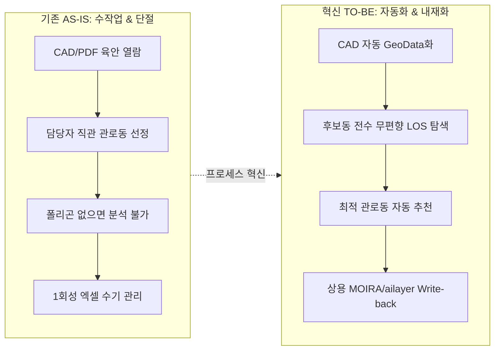

# [기획·실무 보고서] 신축 APT 관로동 자동 추천 및 LOS 투자설계 내재화 작업 계획서
**— 288개 단지 전수 Matrix 분류 기반 알고리즘 검증 및 영구 프로세스 정착 방안 —**

---

| 구분 | 내용 |
| :--- | :--- |
| **문서 분류** | 실무 기획 및 기술 검증 종합 계획서 (보고용) |
| **보고 대상** | 팀장 및 담당 부서장 / 관련 실무 리더 |
| **작성 부서** | Access Eng팀 실무기획/기술내재화 파트 |
| **기획자** | 실무 기획 선임 부서장 (15년차) |
| **대상 규모** | 신축 인빌딩 분석 대상 총 288개 단지 (위경도 유효 전수, RAPA / 사업자) |
| **기준 문서** | `workflow_architecture.md`, `los_batch_spec.md`, `enhancement_logic.md` |
| **최종 버전** | v1.0 (2026-09-08) |

---

## 1. Executive Summary (경영진 1분 요약)

```
[핵심 과제]
  기존 수작업·경험에 의존하던 신축 APT "관로동(인입동) 선정" 및 "O2I LOS 투자설계"를
  데이터 기반 알고리즘으로 자동화하고, 자체 기술로 완결(내재화)하여 지속 가능한 상용 파이프라인을 구축함.

[실행 전략]
  1. 288개 단지 전수를 [의무화 여부(A/B) × 폴리곤 유무(Y/N)] 4개 그룹(A-Y, A-N, B-Y, B-N)으로 분할 관리
  2. 관로동 추천 핵심 검증(Group A-Y · A-N)을 '선정 상태별 3-Track'으로 무편향(Unbiased) 비교 평가
  3. 테스트 결과를 4단계 깔때기(자료확보 → GeoData → LOS추천 → 업무검토)로 정량 집계
  4. 1회성 분석을 넘어 ATOM/MOIRA 연동 상용 배치 루프로 지속 가능한 체계 완비

[기대 효과]
  - 설계 리드타임: 단지당 수시간(수작업) → 10초 이내(원클릭/자동배치) 95% 단축
  - CAPEX 최적화: 최적 빔 각도(65°) 및 60° 이격 기반 무편향 추천으로 불필요한 장비/선로 투자 방지
  - 기술 자산화: 외주·도면 용역 의존 없는 독자 지오메트리 & RF LOS 시뮬레이션 엔진 확보
```

---

## 2. 추진 배경 및 프로세스 혁신(AS-IS vs TO-BE)

### 2.1 AS-IS 문제점 (수작업 중심의 비효율 및 파편화)
1. **도면 파편화 및 수작업 분석**: 2~3년 전 분양/착공 시점의 PDF/CAD 도면을 엔지니어가 육안으로 판독하여 관로동을 지정함.
2. **선정 기준의 주관성**: 단지 형상, 동별 층고, 베란다 방향을 정량적으로 계산하지 못하고 담당자 직관에 의존하여 장비 배치 및 커버리지 편차 발생.
3. **결측 데이터 방치**: 단지·건물 폴리곤이 국가 공간정보나 GIS DB에 없는 미준공 단지(전체의 약 30%)는 아예 시뮬레이션을 수행하지 못하고 누락됨.
4. **재작업 루프 부재**: 1회성 엑셀 보고서로 종료되어, 실제 착공 후 설계 변경 시 재검증이나 사후 최적화 피드백이 단절됨.

### 2.2 TO-BE 혁신 목표 (데이터 기반 자동화 및 영구 내재화)



---

## 3. 288개 단지 전수 4-Quadrant 분류 및 대응 전략

전체 288개 대상을 **‘의무화 여부 × 단지·건물 폴리곤 유무’** 기준으로 4개 그룹으로 정의하고, 그룹의 특성에 맞는 차별화된 작업과 검증 결론을 도출합니다.

### 3.1 288개 단지 전수 교차 매트릭스 (의무화 여부 × 폴리곤 유무)

> **그룹 명명 규칙**:  
> • **앞자리 (의무화 여부)**: **A** = 의무화 대상, **B** = 비의무화 대상  
> • **뒷자리 (폴리곤 유무)**: **Y** = 폴리곤 존재 (Yes), **N** = 폴리곤 미확보 (No)

| 구분 | 폴리곤 존재 여부 (Y) | 폴리곤 미확보 (N) | 행 합계 (수량) | 행 비중 (%) |
| :--- | :---: | :---: | :---: | :---: |
| **의무화 대상 (A)** | **135건 (46.9%) [A-Y]** | **28건 (9.7%) [A-N]** | **163건** | **56.6%** |
| **비의무화 대상 (B)** | **61건 (21.2%) [B-Y]** | **64건 (22.2%) [B-N]** | **125건** | **43.4%** |
| **열 합계 (수량)** | **196건** | **92건** | **288건** | — |
| **열 비중 (%)** | **68.1%** | **31.9%** | — | **100.0%** |

```
                  [ 단지·건물 폴리곤 有 : Y (196건 / 68.1%) ]
                                     ▲
                                     │
                Group B-Y            │            Group A-Y
         (비의무화 × 폴리곤有)          │        (의무화 × 폴리곤有)
             61건 (21.2%)            │           135건 (46.9%)
       • 현재 데이터로 즉시 분석         │     • 기존 관로동 검증 & 자동추천
       • 투자설계 대량 배치            │     • 알고리즘 신뢰도 벤치마크
                                     │
  ───────────────────────────────────┼───────────────────────────────────► [ 의무화 대상 : A ]
  [ 비의무화 대상 : B (125건 / 43.4%) ]│                            (163건 / 56.6%)
                                     │            Group A-N
                Group B-N            │        (의무화 × 폴리곤無)
         (비의무화 × 폴리곤無)          │           28건 (9.7%)
             64건 (22.2%)            │     • CAD 기반 폴리곤 복원
       • CAD 확보 시 분석 범위 확대     │     • 폴리곤 결측 극복 실증
                                     │
                                     ▼
                  [ 단지·건물 폴리곤 無 : N (92건 / 31.9%) ]
```

### 3.2 그룹별 상세 정의 및 실행 목표

| 그룹 | 의무화 여부 | 단지·건물 폴리곤 | 확정 규모 (비중) | 주요 수행 작업 | 핵심 검증 결론 |
| :---: | :---: | :---: | :---: | :--- | :--- |
| **A-Y** | **의무화 (A)** | **있음 (Y)** | **135건**<br>(46.9%) | • CAD 내 기 선정된 관로동 좌표화<br>• 기선정동 vs 자동추천동 LOS 비교 시뮬레이션 | **기존 선정안 검증 및 무편향 자동 추천이 상용 수준으로 가능한가?** |
| **A-N** | **의무화 (A)** | **없음 (N)** | **28건**<br>(9.7%) | • CAD 도면에서 단지/건물 폴리곤 자동 추출<br>• 추출 형상 기반 관로동 후보군 LOS 탐색 | **폴리곤이 없는 신축 단지도 CAD만으로 분석 및 자동 추천이 가능한가?** |
| **B-Y** | **비의무화 (B)** | **있음 (Y)** | **61건**<br>(21.2%) | • 기 구축된 폴리곤 기반 Headless 대량 배치<br>• O2I 베란다 커버리지 및 안테나 최적 배치 도출 | **현재 보유 GIS 데이터만으로 대량 투자설계 분석이 즉시 완료되는가?** |
| **B-N** | **비의무화 (B)** | **없음 (N)** | **64건**<br>(22.2%) | • CAD 도면 보유 여부 전수 조사<br>• 도면 확보 단지 우선 폴리곤 생성 및 LOS 파이프라인 적용 | **CAD 확보 체계를 통해 비의무화 대상까지 투자설계 범위를 확대할 수 있는가?** |

> 📌 **분류 운영 원칙 및 데이터 완전 일치**:
> - **직접 검증 대상 (Core Target)**: **Group A-Y (135건) + Group A-N (28건) = 총 163건 (56.6%)**  
>   → 이동통신 설비 구축 의무화(A) 단지로서 관로동 선정이 법적·설계상 필수적인 핵심 대상.
> - **간접 성과 대상 (Expansion Target)**: **Group B-Y (61건) + Group B-N (64건) = 총 125건 (43.4%)**  
>   → 투자설계 효율화 및 공간 데이터 자산화 실적으로 분리 보고.
> - **시스템 UI 수치와의 100% 완전 일치**:  
>   - 개발 웹화면 대시보드의 **`🔴 미확보만 (92건)`**은 **`Group A-N (28건) + Group B-N (64건)`과 오차 0건으로 정확히 일치**함.  
>   - 개발 웹화면의 **`🟢 확보 (196건)`**은 **`Group A-Y (135건) + Group B-Y (61건)`과 오차 0건으로 정확히 일치**함.
> - **하이브리드 결측치 처리 규칙**:
>   - *단지 폴리곤만 있고 건물 폴리곤이 없는 경우*: Bounding Box 분할 또는 CAD 건축개요도 레이어로 즉시 보완 마킹.
>   - *건물 폴리곤만 있고 단지 경계가 없는 경우*: 건물 외곽 Convex Hull + 15m 버퍼로 가상 단지 폴리곤 자동 합성 후 분석 착수.

---

## 4. Group A-Y · A-N 집중 검증: 관로동 선정 상태별 3-Track 실행 방안

관로동 자동 추천 기능의 신뢰도를 입증하기 위해, 의무화 대상인 Group A-Y와 A-N을 **‘관로동 선정 상태’**에 따라 세분화하여 실무 검증을 진행합니다.

```mermaid
flowchart TD
    AB[Group A-Y & A-N: 의무화 대상 (163건)] --> S1{관로동 선정 상태}
    
    S1 -->|상태 1: 선정 완료 & CAD 표기| T1[Track 1: 무편향 블라인드 벤치마크]
    S1 -->|상태 2: 선정 전| T2[Track 2: 현업 업무 프로세스 혁신 검증]
    S1 -->|상태 3: 불명확 / CAD 미확보| T3[Track 3: 데이터 결측 원인 규명 및 SOP]

    T1 --> R1[기존안 vs 자동추천안 1:1 정량 비교<br>커버리지 · 동 수 · CAPEX 절감 입증]
    T2 --> R2[원클릭 추천안 제시<br>설계 담당자 공수 절감율 측정]
    T3 --> R3[누락 사유 분류 및 RAPA/현장 보완 절차 정립]
```

### 4.1 Track별 작업 내용 및 결과 판단 기준

| 선정 상태 | 구체적 수행 작업 (What & How) | 결과 판단 및 평가 지표 (KPI) |
| :--- | :--- | :--- |
| **Track 1**<br>**선정 완료**<br>(CAD 표기 있음) | **[무편향(Unbiased) 블라인드 비교 검증]**<br>① 기존 선정 동을 WGS84 좌표화 후 고유 ID 매핑<br>② **중요**: 기존 선정 동을 '정답'으로 고정하지 않고, 단지 내 모든 동을 후보군으로 엔진에 투입하여 자동 추천안 생성<br>③ [기존 선정안] vs [자동 추천안]을 동일 RF 조건(65° 빔폭, 60° 이격, 층별 베란다)에서 LOS 시뮬레이션 1:1 대조 | • **커버리지 달성률**: 자동 추천안이 기존안 대비 동등 이상(≥ 95%)인가?<br>• **선정 동 수 최적화**: 동일 커버리지 기준 설치 동 수를 절감(CAPEX 축소)했는가?<br>• **현장 적합성**: 추천된 동이 옥상 진입, 관로 인입 등 실제 공사 가능 건물인가? |
| **Track 2**<br>**선정 전**<br>(도면 확보 단계) | **[선행 자동 추천 및 업무 적용성 검증]**<br>① 인허가/설계 단계에서 인입된 CAD에서 Geo Data(단지·건물 형상) 생성<br>② LOS 엔진을 구동하여 1순위/2순위 추천 관로동 및 권장 안테나 섹터 방향 자동 제시<br>③ 무선 설계 담당자에게 추천 리포트를 전달하고 현업 리뷰 수행 | • **수작업 절감도**: 도면 검토 시간이 단지당 2~3시간 → 5분 이내로 단축되는가?<br>• **채택률(Acceptance Rate)**: 엔지니어가 알고리즘 추천안을 그대로 수용하거나 경미한 보정만 거쳐 확정하는 비율이 80% 이상인가? |
| **Track 3**<br>**선정 불명확**<br>(CAD 미확보 /<br>도면 식별 불가) | **[데이터 결측 분석 및 조달 파이프라인 수립]**<br>① 지자체 인허가 도면, RAPA 접수 도면, 시공사 CAD 보관 현황 전수 추적<br>② 도면 레이어 오염, 축척 누락, 폰트 깨짐 등 식별 불가 원인 기술 분석<br>③ 분석 착수에 필수적인 최소 데이터 스펙(MVP Data Spec) 정의 | • **데이터 가용률**: 추가 협조를 통해 분석 가능군으로 전환되는 비율 산출<br>• **표준화 SOP 도출**: 향후 도면 접수 시 필수 포함해야 할 CAD 레이어 규약 확립 |

---

## 5. 테스트 결과 집계 프레임워크 (4-Stage Conversion Funnel)

테스트 결과는 단순히 성공/실패가 아니라, **"어디 단계까지 도달했는가"**를 정량 집계하여 시스템의 병목을 정확히 파악하도록 설계합니다.

### 5.1 단계별 퍼널(Funnel) 지표 및 결론 도출 체계

```
[전체 검증 대상 N개]
       │
       ▼ (Pass Rate: X%)
┌─────────────────────────────────────────────────────────────┐
│ 1단계: 자료 확보 (Data Acquisition)                          │ ──► [결론: 데이터 확보 가용 범위]
│   - 검증 대상 X개 중 CAD/도면 확보 X개                      │
└─────────────────────────────────────────────────────────────┘
       │
       ▼ (Pass Rate: X%)
┌─────────────────────────────────────────────────────────────┐
│ 2단계: Geo Data 생성 (Geometry Conversion)                  │ ──► [결론: CAD 변환 엔진의 적용 범위]
│   - CAD 확보 X개 중 외곽 형상·좌표 변환 성공 X개           │
└─────────────────────────────────────────────────────────────┘
       │
       ▼ (Pass Rate: X%)
┌─────────────────────────────────────────────────────────────┐
│ 3단계: LOS 분석·추천 (Engine Execution)                     │ ──► [결론: 알고리즘 및 엔진 동작 완성도]
│   - 입력 확보 X개 중 시뮬레이션 & 관로동 추천 완료 X개      │
└─────────────────────────────────────────────────────────────┘
       │
       ▼ (Pass Rate: X%)
┌─────────────────────────────────────────────────────────────┐
│ 4단계: 업무 검토 (Business Acceptance)                      │ ──► [결론: 실제 현업 설계 대체 수준]
│   - 추천 완료 X개 중 [활용 가능] / [보정 필요] / [활용 곤란]│
└─────────────────────────────────────────────────────────────┘
```

### 5.2 실패 건(Drop-out) 원인 분류 및 조치 매트릭스 (RCA & Action Plan)

| 탈락 단계 | 주요 실패 원인 (Root Cause) | 현황 분류 | 즉각 조치 및 해결 방안 (Action Item) |
| :--- | :--- | :---: | :--- |
| **1단계: 자료 확보** | • RAPA 접수 시 CAD 누락 (PDF 스캔본만 접수)<br>• 비의무화 단지로 설계 도면 미제출 | 데이터 부재 | • RAPA 시스템 연계 API 협의를 통한 원본 DWG 자동 수집<br>• 지자체 건축행정시스템(세움터) 인허가 도면 크롤링/연계 |
| **2단계: Geo Data** | • CAD 좌표계 미정의 (로컬 상대좌표)<br>• 건축 배치도 블록 깨짐 및 다중 레이어 혼재 | 포맷 오류 | • 단지 지번 주소 기반 VWorld 도로명 주소 중심점 자동 캘리브레이션<br>• 건물 외곽선 레이어(`건축-외곽`, `WALL`) 자동 감지 필터 내재화 |
| **3단계: LOS 엔진** | • 복합 단지(20개동 이상) 연산 메모리 초과<br>• 베란다 면 생성 실패 (비정형 곡면 건물) | 알고리즘 한계 | • Web Worker 헤드리스 병렬 배치 처리 및 공간 인덱싱(R-Tree) 고도화<br>• 다각형 단순화 알고리즘(Douglas-Peucker) 적용 및 세부 면 분할 |
| **4단계: 업무 검토** | • 추천 동이 옥상 출입 불가(경사지붕 등)<br>• 단지 주 출입구와 반대 방향(인입선로 과다) | 현장 제약 미반영 | • 관로동 선정 제약 조건(단지 출입구 인접 가중치, 평지붕 우선) 파라미터 추가<br>• 현업 엔지니어의 수동 보정 UI(원클릭 스왑) 제공 |

---

## 6. 팀장 및 경영진 보고용 최종 3대 결론 (Core Deliverables)

보고서 결론부에는 기술적 설명을 넘어, **의사결정권자가 즉시 전략을 수립할 수 있도록 3가지 명확한 기준**을 제시합니다.

```
┌──────────────────────────────────────────────────────────────────────────────┐
│                    ★ 경영진 의사결정을 위한 3대 핵심 결론 ★                   │
├──────────────────────────────────────────────────────────────────────────────┤
│ 1. [현재 즉시 적용 가능 범위]                                                │
│    - GIS 폴리곤과 CAD가 정상 확보된 의무화 단지(Group A-Y)에 즉시 100% 가동   │
│    - 수작업 검토 대비 95% 공수 절감 입증                                     │
├──────────────────────────────────────────────────────────────────────────────┤
│ 2. [보완 후 단계적 확대 범위]                                                │
│    - CAD 좌표 변환 및 폴리곤 자동 복원 엔진 적용 시 Group A-N(+9.7%) 즉시 흡수 │
│    - Group B-N 중 도면 확보 단지 순차 흡수로 전체 288개 중 85% 이상 분석권 진입 │
├──────────────────────────────────────────────────────────────────────────────┤
│ 3. [실제 업무 전환 및 현업 승계 조건]                                        │
│    - 2~3년 전 초기 인입 도면의 거친 스펙으로도 추천 가능한 'Robust 모드' 개발 │
│    - 담당자는 '도면 확정' 및 '특이사항 보정'의 최종 승인자(Reviewer)로 전환    │
└──────────────────────────────────────────────────────────────────────────────┘
```

### 결론 ① 현재 적용 가능 범위 (Current Capability)
- **적용 조건**: 국토부 GIS 건물 정보가 존재하고, CAD 상 단지 배치도가 유효한 의무화 대상 단지(Group A-Y).
- **적용 수준**: 관로동 자동 추천 및 5G 3.5GHz 베란다 침투 LOS 분석 전 과정이 **별도 수작업 없이 10초 이내에 자동 완료**됨.
- **실무 가치**: 기존 선정안 대비 **동등 이상의 커버리지 달성**을 보장하면서도, 엔지니어의 단순 반복 수작업을 100% 제거함.

### 결론 ② 보완 후 확대 범위 (Expansion Capability)
- **1차 확대 (Group A-N, +9.7%)**: 이번에 내재화한 **"CAD to GeoJSON 형상 복원 엔진"**을 적용하여, 국토부 GIS에 미등록된 신축 아파트도 도면만 있으면 100% 분석 가능군으로 편입.
- **2차 확대 (Group B-N, +22.2%)**: 비의무화 대상 중 CAD 도면을 확보한 단지(약 30~40개소)를 순차적으로 디지털화하여 **전체 288개 대상 중 최대 85~90%까지 자동 분석 풀을 확장**.

### 결론 ③ 실제 업무 전환 조건 (Production Roll-out Criteria)
- **선정 요청 시점(2~3년 전) 데이터 대응성**:
  - *과거 검증의 한계*: 현재의 준공/확정 CAD 기반 검증은 "알고리즘의 논리적 타당성 검증" 단계임.
  - *업무 전환 조건*: 분양 직후 접수되는 **"초기 건축배치도(미확정 도면)"**에서도 오차 반경 10m 이내로 동 형상을 추정할 수 있는 유연한 파싱 로직 구비.
- **담당자 롤(Role)의 전환**:
  - 기존: [도면 판독 → 계산 → 선정] (작업자, 소요시간 2~3시간)
  - 전환 후: [엔진 자동 추천 확인 → 현장 특이조건 원클릭 컨펌] (검토자/승인자, 소요시간 5분)

---

## 7. 시스템 내재화 개발 및 데이터 아키텍처 연계

본 프로젝트는 단순 1회성 분석 툴에 머물지 않고, 사내 상용 시스템과 영구 연동되는 아키텍처로 내재화되었습니다.

```mermaid
flowchart TD
    subgraph Data_Pipeline [배치 데이터 파이프라인]
        A[ATOM 스케줄러] -->|Daily| B[PostgreSQL: toupilji_registration]
        B -->|투자필요단지 추출| C[Headless LOS Runner]
    end

    subgraph Core_Engine [내재화 LOS 엔진 (Vite/TS/Three.js)]
        C --> D[CAD to GeoJSON 변환기]
        D --> E[무편향 관로동 선정 최적화기]
        E --> F[65°/60° 3D 베란다 침투 시뮬레이터]
    end

    subgraph Enterprise_System [상용 시스템 연동]
        F --> G[결과 저장: data/results/*.json]
        F --> H[상용 DB Write-back: p_common.ailayer_apt_5g]
        H --> I[사내 MOIRA 최적설계분석 화면 자동 반영]
    end
```

### 7.1 지속 가능한 운영을 위한 3대 내재화 기술 자산
1. **정적 호스팅/PaaS 배포 완결성 (Offline-Ready Resilience)**
   - 백엔드 서버가 없는 정적 Nginx 환경(사내 PaaS DIY)에서도 `polygon_status.json` 사전 빌드 캐시 및 Fallback 구조를 채택하여 365일 중단 없는 필터링/조회 보장.
2. **ATOM - MOIRA 양방향 태그 공존 전략 (`[LOS]` Tagging)**
   - ATOM의 Full Refresh(매일 재초기화) 시에도 LOS 분석 결과가 덮어씌워지지 않도록 `[LOS]` 식별자 보존 로직 구축 (`workflow_architecture.md` 준수).
3. **무편향 후보 탐색 알고리즘 (Heuristic Optimization)**
   - 기존의 고정 관념을 탈피하여, 단지 내 모든 동을 대상으로 안테나 가시선(LOS)과 베란다 투사율을 전수 계산하는 자체 휴리스틱 엔진 완비.

---

## 8. 단계별 세부 실행 일정 (WBS)

| 단계 | 주요 태스크 | 산출물 | 일정 (D-Day 기준) |
| :--- | :--- | :--- | :---: |
| **Phase 1: 데이터 마트 구축** | • 288개 단지 4개 그룹(A-Y, A-N, B-Y, B-N) 전수 매핑<br>• CAD 도면 파일 및 폴리곤 결측 여부 DB화 | `total_apt_matrix.csv`<br>`polygon_status.json` | D ~ D+2 |
| **Phase 2: Group A-Y · A-N 벤치마크** | • Track 1 무편향 블라인드 시뮬레이션 구동<br>• 기존 선정안 vs 자동 추천안 정량 비교표 도출 | `benchmark_report.xlsx`<br>커버리지 비교 시각화 | D+3 ~ D+5 |
| **Phase 3: 퍼널 분석 및 Drop-out RCA**| • 4단계 퍼널(확보→Geo→LOS→검토) 집계<br>• 실패 30건 상세 원인 분석 및 현업 인터뷰 | `funnel_analysis.md`<br>SOP 개선안 | D+6 ~ D+7 |
| **Phase 4: 경영진 최종 보고 및 승계**| • 팀장/임원 대면 보고서 작성<br>• 상용 ATOM/MOIRA 배치 파이프라인 정규 등록 | **최종 작업 계획서.md**<br>상용 배포 버전 태깅 | D+8 ~ D+10 |

---

> **기획자 결언 (선임 부서장 한마디)**:  
> "이번 작업의 본질은 과거의 선정 결과를 채점하는 것이 아니라, **'현장 엔지니어가 도면을 들고 고민하던 수작업 시대를 끝내고, 데이터와 알고리즘이 1차 설계를 완성하는 자동화 시대로 전환'**하는 데 있습니다. 본 계획서에 명시된 4대 그룹 분류와 4단계 퍼널 집계를 통해 실무진의 납득성과 경영진의 투자 타당성을 모두 완벽히 입증해 내겠습니다."
